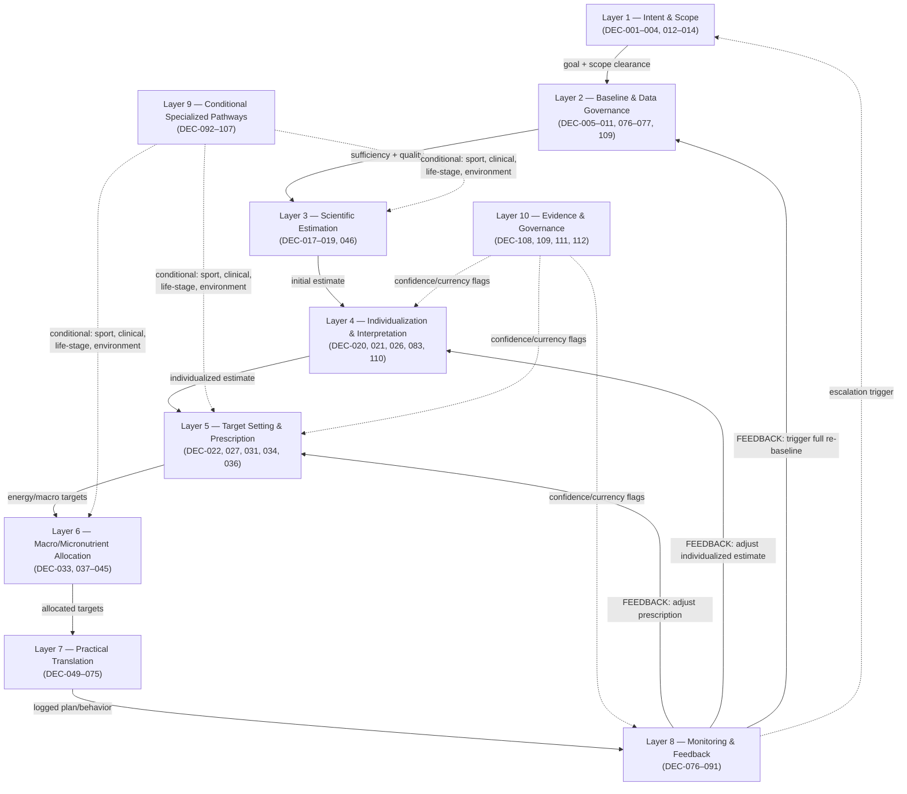
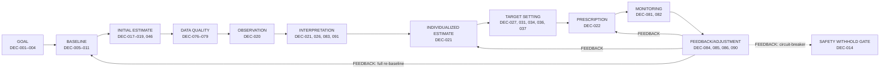

# App Decision Dependency Graph

Phase 3, Document 2 of 5 (`APP_DECISION_INVENTORY → APP_DECISION_DEPENDENCY_GRAPH →
APP_DECISION_KNOWLEDGE_MAPPING → APP_DECISION_GAPS → APP_DECISION_MODEL`).

---

# 1. Purpose

`APP_DECISION_INVENTORY.md` answered *"what decisions does the application need to make?"* — 112
decision records (`DEC-001`–`DEC-112`) across 20 domains. This document answers a different question:

> **Which application decisions depend on which other application decisions, and why?**

This is **not** a curriculum prerequisite graph. `04_PHASE_2_CURRICULUM_ARCHITECTURE/
LEARNING_DEPENDENCY_GRAPH.md` answers *"what knowledge must be learned before other knowledge can be
understood?"* (e.g. `MET-02 → MET-03 → MET-04`) — a statement about teaching order for a human
learner. This document instead traces *information flow between application decision nodes* — e.g.
`DEC-001 (classify goal) → DEC-027 (target rate/direction) → DEC-022 (energy prescription)`. A
curriculum topic dependency does not automatically imply a decision dependency, and the reverse is
equally true: two decisions can share a knowledge domain (both draw on `BODY`) without one decision's
*output* ever feeding the other. This document draws edges only for the latter.

Concretely: this document takes the `Depends On` / `Downstream Use` fields already recorded in
`APP_DECISION_INVENTORY.md` §4 as its primary source of truth, adds the dependency-*type* judgment
(`REQUIRED` / `STRONGLY_RECOMMENDED` / `INFORMATIVE` / `CONDITIONAL` / `FEEDBACK`) those fields didn't
carry, makes explicit several loop-closing edges that exist conceptually (recorded in a
`Downstream Use` field pointing back to an earlier-stage decision) but weren't drawn as graph edges
before, and organizes the whole thing into layers, subgraphs, and the structural roles (root,
terminal, high-fan-out, high-fan-in, bridge) the inventory could not assess decision-by-decision on
its own.

**What this document does not do:** invent formulas, thresholds, scoring systems, ML methods, database
schemas, APIs, or UI behavior; resolve any open Phase 1/2 curriculum-architecture question; force the
graph into a DAG where the application is genuinely adaptive and cyclical; or introduce, delete, or
rename any `DEC` ID from the inventory.

---

# 2. Graph Principles

**An edge `DEC-A → DEC-B` means:** the *output* of DEC-A is materially needed, constrains, informs, or
conditions DEC-B's determination. Nothing weaker than that draws an edge.

**What does NOT create an edge:**
- **Shared inputs.** If DEC-A and DEC-B both consume disclosed body weight directly from the user
  profile, that is not a dependency between DEC-A and DEC-B — neither one's *output* feeds the other.
  (Per the inventory's own §17-equivalent warning.)
- **Shared knowledge domain.** If DEC-A and DEC-B both draw on `BODY` per their `Relevant Knowledge
  Domains` field, that is a curriculum-content fact, not a decision-dependency fact.
- **Thematic similarity.** Two decisions "about" energy, or "about" sport, are not automatically
  connected — see DEC-092 (training data intake) and DEC-014 (safety withhold-prescription boundary):
  both plausibly relevant to an athlete's case, but nothing in DEC-092's output feeds DEC-014 or vice
  versa, so no edge is drawn between them.
- **Textbook chapter order.** A source book teaching topic X before topic Y implies nothing about which
  application decision must precede which.

**Dependency types used** (exactly the five named in the governing brief):

| Type | Meaning | Notation |
|---|---|---|
| `REQUIRED` | B cannot be meaningfully performed without A's output. | `A ──REQUIRED──→ B` |
| `STRONGLY_RECOMMENDED` | B can technically proceed without A, but is substantially weaker/less reliable without it. | `A ──STRONGLY_RECOMMENDED──→ B` |
| `INFORMATIVE` | A provides useful context to B but is not a prerequisite — B has a sensible default without it. | `A ──INFORMATIVE──→ B` |
| `CONDITIONAL` | B depends on A only under a named circumstance (a pathway: clinical, sport, life-stage, pregnancy, disclosed environment, disclosed competition, etc.). | `A ──CONDITIONAL──→ B` |
| `FEEDBACK` | A later observation/adjustment decision feeds information back into an earlier estimation/prescription decision, closing a loop. | `A ──FEEDBACK──→ B` |

**On cycles:** the application is adaptive by design (§7 of the inventory; §5 of the governing brief
here). Real feedback cycles are represented explicitly as `FEEDBACK` edges rather than broken to force
a DAG — see §7 and §17 below. A cycle is not a graph defect here; a graph with *no* feedback edges
would be the actual defect, since it would misrepresent the application as a one-shot calculator.

**On uncertainty propagation:** where an upstream decision's own uncertainty (its `Current Evidence
Required` or effectively-provisional nature) measurably affects a downstream decision's reliability,
this is noted in that edge's `Uncertainty` field (§6) rather than modeled as a separate node — see §10
for the cross-cutting picture.

---

# 3. Application Decision Layers

The inventory's 20 domains (A–T) are the *content* grouping. This section regroups the same 112
decisions into **10 functional layers** — a orthogonal cut that shows how information actually moves
through the system, independent of which domain "owns" a given decision.

| Layer | Function | Domains Drawn From | Representative DEC IDs |
|---|---|---|---|
| 1. Intent & Scope | Establish what the user wants and whether the app may proceed at all | A, C | DEC-001–004, DEC-012–014 |
| 2. Baseline & Data Governance | Establish what is known, how reliable it is, and what's missing | B, parts of N/T | DEC-005–011, DEC-076–077, DEC-109 |
| 3. Scientific Estimation | Produce Level-1 population/model-based figures | D (early), H (early) | DEC-017–019, DEC-046 |
| 4. Individualization & Interpretation | Reconcile model estimate against observed reality | D (mid), E, T | DEC-020, DEC-021, DEC-026, DEC-083, DEC-110 |
| 5. Target Setting & Prescription | Decide what should currently be recommended (Level 2) | D (late), E (late), F (early) | DEC-022, DEC-027, DEC-031, DEC-034, DEC-036 |
| 6. Nutrient/Macro & Micronutrient Allocation | Distribute and adjust targets across nutrients and occasions | F (late), G | DEC-033, DEC-037–045 |
| 7. Practical Translation | Turn targets into foods, meals, preparation, and shopping (Level 3) | H (late), I, J, K, L, M | DEC-049–075 |
| 8. Monitoring & Feedback | Log, validate, interpret, and adjust over time | N, O | DEC-076–091 |
| 9. Conditional Specialized Pathways | Route to sport/clinical/life-stage/public-health variants | P, Q, R, S | DEC-092–107 |
| 10. Evidence & Governance | Flag currency, detect conflicts, standardize confidence communication | T | DEC-108, DEC-109, DEC-111, DEC-112 |

**Reading note:** several decisions genuinely span two layers rather than sitting cleanly in one —
e.g. DEC-045 (population-specific micronutrient screening) is Layer 6 in its primary function but is
*triggered* by Layer 9's life-stage/clinical/athlete classifications; DEC-024 (energy confidence
communication) is Layer 5 in placement but Layer 10 in function. These are not forced into a single
layer; the table above lists each decision's dominant layer only, and cross-layer edges are exactly
what §6's register traces.

---

# 4. Global Decision Dependency Map

A layer-level view only — not all 112 nodes (per the governing brief's explicit instruction not to
produce one unreadable 112-node diagram). Each box is a *layer* (§3); the personalization loop's
feedback arrows are drawn explicitly since they are this system's defining structural feature.



**Reading the diagram:** solid arrows are the forward, single-pass pipeline (Layers 1→2→3→4→5→6→7);
dashed arrows are `CONDITIONAL` (Layer 9's specialized pathways feeding into whichever forward layer
they modify) or cross-cutting (`Layer 10`'s evidence/confidence flags, which attach to many downstream
layers without gating any of them outright). The heavy dotted arrows from Layer 8 back into Layers 5,
4, and 2 are the `FEEDBACK` edges that make this a loop rather than a pipeline — detailed with actual
DEC IDs in §7.

---

# 5. Major Decision Subgraphs

Nine coherent clusters, discovered from the actual `Depends On`/`Downstream Use` structure rather than
assumed in advance. Each is shown with its real DEC IDs.

### A. Goal → Prescription
```
DEC-001 → DEC-004 (safety-scope check)
DEC-001 → DEC-003 → DEC-101 (conflict reconciliation, conditional on clinical flag)
DEC-001, DEC-003 → DEC-027 (target rate/direction) ┐
DEC-021 (individualized estimate) ──────────────────┼→ DEC-022 (energy prescription)
DEC-014 (safety gate) ───────────────────────────────┘
```
The single most heavily-converged decision in the whole graph is DEC-022 — see §13.

### B. Baseline → Energy
```
DEC-001 → DEC-005 (required-field list) → DEC-006 (sufficiency) → DEC-017 → DEC-018 → DEC-019
```
A clean, mostly-linear `REQUIRED` chain — the closest thing in this inventory to a true prerequisite
staircase, structurally resembling (but conceptually distinct from) a Phase-2-style learning sequence.

### C. Observation → Individualization
```
DEC-076 (what's logged) → DEC-078 (adherence) → DEC-020 (sufficiency for individualization)
DEC-019 (initial estimate) ─────────────────────→ DEC-020 → DEC-021 (individualized estimate)
```
This is the pipeline's first true data-quality gate (§8/§10 both trace through it).

### D. Macronutrient Allocation
```
DEC-022 (energy) ─┬→ DEC-031 (protein) ──┐
DEC-092 (training) ┤                      ├→ DEC-034 (carb) → DEC-036 (fat) → DEC-038 (pattern) → DEC-040 (conflict resolution)
                    └──────────────────────┘
```
Protein is computed first (least energy-budget-dependent), then carbohydrate consumes the remaining
budget net of protein, then fat is the remainder — an ordering visible directly in the `Depends On`
chains (DEC-034 depends on DEC-031; DEC-036 depends on both).

### E. Nutrient → Meal
```
DEC-056 (per-occasion targets) → DEC-060 (target→food translation boundary) → DEC-061 (restriction filter)
    → DEC-062 (nutrient-density ranking) → DEC-064 (cost/convenience) → DEC-065 (pantry-aware) → DEC-066 (constructed meal)
```
The longest single `REQUIRED` chain in the inventory (7 hops) — consistent with Decision Model
Principles #6/#7 requiring the target→food and food→meal boundaries to stay distinct rather than
collapsing into one step.

### F. Meal → Shopping
```
DEC-066, DEC-069 (constructed meals across days) → DEC-071 (shopping list) → DEC-072 (pantry reconciliation)
    → DEC-073 (budget) / DEC-074 (availability) / DEC-075 (frequency minimization) [terminal]
```

### G. Sport
```
DEC-092 (training data intake) → DEC-093 (recreational vs. structured classification)
    → DEC-094 (competition window) [CONDITIONAL]
    → DEC-096 (environment) [CONDITIONAL] → DEC-048 (fluid/electrolyte environment adjustment)
    → DEC-098 (female-athlete track) [CONDITIONAL] → DEC-095 (RED-S/overtraining detection)
DEC-092 also feeds DEC-019, DEC-031/032, DEC-034/035, DEC-047, DEC-057 directly (the "single hook"
pattern noted in the inventory — see §14, Bridge Decisions).
```

### H. Clinical
```
DEC-012 (scope check) ⇄ DEC-099 (supported-conditions boundary) [mutual — see §17]
    → DEC-100 (upstream modification) → DEC-021, DEC-031, DEC-034, DEC-036, DEC-041 [CONDITIONAL, fans out]
    → DEC-101 (goal-conflict resolution) / DEC-102 (pathway routing)
```

### I. Monitoring → Adjustment
```
DEC-076 → DEC-077/078/079 (quality, adherence, missing-data handling) → DEC-081 (quantity gate)
    → DEC-082 (quality gate) → DEC-083 (interpretation) → DEC-084 (adjustment)
    → DEC-085 (macro recompute) → DEC-086 (meal/food regenerate) → DEC-089 (user notification)
DEC-084 also FEEDBACK→ DEC-021/022 (see §7); DEC-090 (circuit-breaker) FEEDBACK→ DEC-014.
```

### J. Evidence / Uncertainty
```
DEC-009/010 (profile plausibility/conflict) → DEC-109 (general conflict detection)
DEC-024, DEC-029, DEC-077 (domain-specific confidence signals) → DEC-112 (unified confidence convention) [INFORMATIVE, generalizing]
DEC-021, DEC-082, DEC-083 → DEC-110 (model/observation mismatch) — the hardest single node in the graph (§17)
DEC-108, DEC-111 are largely terminal/cross-cutting rather than chain-internal.
```

---

# 6. Complete Dependency Register

Every edge below is sourced from `APP_DECISION_INVENTORY.md` §4's `Depends On` fields (forward edges)
plus the `Downstream Use` fields that point back to an earlier-stage decision (`FEEDBACK` edges,
explicitly listed separately at the end of each domain's table where they occur). Grouped by the
**target** (`To`) decision's domain for navigability — an edge's source (`From`) may belong to a
different domain, which is exactly the cross-domain structure §12 of the inventory already flagged.

**Column key:** *Rationale* = why the edge exists; *Trigger* = the condition under which a
`CONDITIONAL` edge activates (— if unconditional); *Data Flow* = what specifically moves from From to
To; *Uncertainty* = whether/how upstream uncertainty propagates through this specific edge (— if not
applicable).

## Edges into Domain A (Goal Classification)

| From | To | Type | Rationale | Trigger | Data Flow | Uncertainty |
|---|---|---|---|---|---|---|
| DEC-001 | DEC-002 | REQUIRED | Goal clarity can't be judged before a goal category exists | — | Goal category label | — |
| DEC-001 | DEC-003 | REQUIRED | Reconciliation needs the candidate goal(s) to reconcile | — | Goal category label(s) | — |
| DEC-001 | DEC-004 | REQUIRED | Scope check needs the classified goal to evaluate | — | Goal category | — |
| DEC-002 | DEC-004 | REQUIRED | An unresolved vague goal can't be scope-checked meaningfully | — | Clarified/operational goal | Low-confidence goal weakens DEC-004's basis |
| DEC-003 | DEC-004 | REQUIRED | Reconciled goal (not raw conflicting goals) is what gets scope-checked | — | Resolved/sequenced goal | — |

## Edges into Domain B (User Profile and Baseline)

| From | To | Type | Rationale | Trigger | Data Flow | Uncertainty |
|---|---|---|---|---|---|---|
| DEC-001 | DEC-005 | REQUIRED | Required-field list varies by goal category | — | Goal category | — |
| DEC-005 | DEC-006 | REQUIRED | Sufficiency can't be judged without the required-field list | — | Required-field list | — |
| DEC-005 | DEC-007 | REQUIRED | Prioritizing missing fields needs the required-field list | — | Required-field list | — |
| DEC-006 | DEC-007 | STRONGLY_RECOMMENDED | Knowing what's already sufficient sharpens which gaps matter most | — | Sufficiency verdict | — |
| DEC-006 | DEC-008 | REQUIRED | Refusal-handling only activates once a field is known missing/insufficient | — | Insufficiency verdict | — |
| DEC-009 | DEC-010 | REQUIRED | Conflict resolution presumes a plausibility check already ran | — | Plausibility flag | Implausible data raises conflict-resolution's own uncertainty |

## Edges into Domain C (Safety, Scope and Escalation)

| From | To | Type | Rationale | Trigger | Data Flow | Uncertainty |
|---|---|---|---|---|---|---|
| DEC-099 | DEC-012 | REQUIRED | The supported-conditions list is what defines the scope boundary DEC-012 evaluates against | — | Supported/unsupported condition list | — |
| DEC-103 | DEC-012 | CONDITIONAL | Only life-stage flags that are themselves out-of-scope (pregnancy, pediatric) matter here | Disclosed pregnancy/pediatric/other flagged life stage | Life-stage assignment | — |
| DEC-012 | DEC-013 | REQUIRED | Red-flag evaluation presumes the user is already determined in-scope | — | In-scope determination | — |
| DEC-080 | DEC-013 | REQUIRED | Red-flag detection consumes the monitoring check-in trigger | — | Check-in/escalation trigger | Weak monitoring data quality weakens red-flag detection |
| DEC-012 | DEC-014 | REQUIRED | Withhold-prescription boundary is downstream of the coarse scope check | — | In/out-of-scope verdict | — |
| DEC-013 | DEC-014 | REQUIRED | A red flag is one of the direct triggers for withholding | — | Red-flag trigger | — |
| DEC-012 | DEC-015 | REQUIRED | Coordination-with-clinician logic only applies to in-scope users | — | In-scope determination | — |
| DEC-013 | DEC-016 | REQUIRED | Ongoing monitoring for escalation patterns builds on the single-point red-flag criteria | — | Red-flag criteria | — |
| DEC-076 | DEC-016 | REQUIRED | Ongoing monitoring needs a data stream to monitor | — | Logged monitoring data | Sparse logging weakens pattern detection |

## Edges into Domain D (Energy)

| From | To | Type | Rationale | Trigger | Data Flow | Uncertainty |
|---|---|---|---|---|---|---|
| DEC-005 | DEC-017 | REQUIRED | Baseline sufficiency check needs the required-field list | — | Required-field list | — |
| DEC-006 | DEC-017 | REQUIRED | Can't gate on sufficiency before sufficiency is itself evaluated | — | Sufficiency verdict | Defaults-in-place (from DEC-006) propagate as reduced confidence |
| DEC-017 | DEC-018 | REQUIRED | Method-class selection presumes baseline data is already judged adequate | — | Sufficiency verdict | — |
| DEC-018 | DEC-019 | REQUIRED | TEE estimate needs a chosen method-class first | — | Method-class selection | — |
| DEC-092 | DEC-019 | REQUIRED | TEE without activity/training data is only a resting-expenditure estimate, not total | — | Structured training data | Absent training data forces a less complete TEE estimate |
| DEC-019 | DEC-020 | REQUIRED | Individualization-sufficiency is judged against the initial estimate it would replace | — | Initial TEE figure | — |
| DEC-076 | DEC-020 | REQUIRED | Observed-data sufficiency needs actual logged data to evaluate | — | Logged intake/weight history | — |
| DEC-078 | DEC-020 | STRONGLY_RECOMMENDED | Adherence quality strengthens confidence in whether "enough" data has really accumulated | — | Adherence-rate signal | Low adherence should delay the sufficiency verdict |
| DEC-019 | DEC-021 | REQUIRED | Individualized estimate is explicitly a reconciliation *against* the initial estimate | — | Initial TEE figure | — |
| DEC-020 | DEC-021 | REQUIRED | Can't reconcile without the observed data judged sufficient/usable | — | Sufficiency verdict + observed data | Weak observed-data quality directly lowers DEC-021's own confidence |
| DEC-021 | DEC-022 | REQUIRED | Prescription is computed from the individualized maintenance figure | — | Individualized maintenance-energy figure | Uncertainty here propagates directly into the prescription |
| DEC-001 | DEC-022 | REQUIRED | Prescription direction (surplus/deficit/maintenance) is goal-driven | — | Goal category | — |
| DEC-003 | DEC-022 | REQUIRED | A reconciled (not raw conflicting) goal is what the prescription targets | — | Resolved goal | — |
| DEC-014 | DEC-022 | REQUIRED | A withhold-prescription verdict blocks DEC-022 outright | — | Withhold/proceed verdict | — |
| DEC-011 | DEC-023 | REQUIRED | A staleness trigger is one of the two events that can trigger recomputation | — | Re-confirmation trigger | — |
| DEC-020 | DEC-023 | REQUIRED | New individualization-sufficiency status is the other recompute trigger | — | Sufficiency verdict | — |
| DEC-009 | DEC-024 | STRONGLY_RECOMMENDED | Implausible profile data should lower displayed confidence | — | Plausibility flag | Direct — this edge exists specifically to carry uncertainty forward |
| DEC-020 | DEC-024 | STRONGLY_RECOMMENDED | Observed-data insufficiency should lower displayed confidence | — | Sufficiency verdict | Direct |
| DEC-021 | DEC-024 | REQUIRED | The confidence figure is about DEC-021's own estimate | — | Estimate-divergence magnitude | Direct — this is the primary uncertainty this edge carries |

## Edges into Domain E (Weight and Body Composition)

| From | To | Type | Rationale | Trigger | Data Flow | Uncertainty |
|---|---|---|---|---|---|---|
| DEC-001 | DEC-025 | REQUIRED | Metric set (weight-only vs. + composition) depends on the goal | — | Goal category | — |
| DEC-025 | DEC-026 | REQUIRED | Trend interpretation needs to know which metrics are even being tracked | — | Metric set | — |
| DEC-076 | DEC-026 | REQUIRED | Trend interpretation needs the actual logged time series | — | Weight/composition time series | Sparse/irregular logging weakens trend confidence |
| DEC-001 | DEC-027 | REQUIRED | Target rate/direction depends on the goal | — | Goal category | — |
| DEC-003 | DEC-027 | REQUIRED | A reconciled goal (not raw conflicting goals) sets the target rate | — | Resolved goal | — |
| DEC-014 | DEC-027 | REQUIRED | A withhold verdict blocks target-rate setting too | — | Withhold/proceed verdict | — |
| DEC-021 | DEC-027 | REQUIRED | Target rate is set relative to the individualized maintenance estimate | — | Individualized maintenance figure | Estimate uncertainty propagates into rate-setting |
| DEC-026 | DEC-028 | REQUIRED | Reassessment can only trigger off a trend that's actually been classified | — | Trend classification | Noise misclassified as trend would falsely trigger reassessment |
| DEC-025 | DEC-029 | REQUIRED | Judging weigh-in completeness needs to know what's supposed to be logged | — | Metric set | — |
| DEC-001 | DEC-030 | REQUIRED | Recomposition-specific monitoring routing depends on the goal category | — | Goal category | — |
| DEC-003 | DEC-030 | REQUIRED | Depends on the reconciled (possibly recomposition) goal | — | Resolved goal | — |

## Edges into Domain F (Macronutrients)

| From | To | Type | Rationale | Trigger | Data Flow | Uncertainty |
|---|---|---|---|---|---|---|
| DEC-001 | DEC-031 | REQUIRED | Protein target depends on goal (e.g. lean-mass gain vs. general health) | — | Goal category | — |
| DEC-022 | DEC-031 | REQUIRED | Protein target is set within the overall energy prescription's budget | — | Energy prescription | Energy-prescription uncertainty bounds protein-target confidence |
| DEC-092 | DEC-031 | REQUIRED | Training status is a direct input to the protein-requirement decision | — | Training data | — |
| DEC-031 | DEC-032 | REQUIRED | Adjustment is relative to the baseline just computed | — | Baseline protein target | — |
| DEC-092 | DEC-032 | REQUIRED | The adjustment itself is driven by training load | — | Training data | — |
| DEC-031 | DEC-033 | REQUIRED | Distribution needs a total to distribute | — | Protein target | — |
| DEC-032 | DEC-033 | REQUIRED | Distribution uses the training-adjusted, not baseline, figure | — | Adjusted protein target | — |
| DEC-055 | DEC-033 | REQUIRED | Distribution across occasions needs the occasion structure to exist first | — | Eating-occasion count/structure | — |
| DEC-022 | DEC-034 | REQUIRED | Carb target is set within the overall energy budget | — | Energy prescription | — |
| DEC-031 | DEC-034 | REQUIRED | Carb target is computed net of the protein allocation already made | — | Protein target | — |
| DEC-092 | DEC-034 | REQUIRED | Training status directly informs carbohydrate need | — | Training data | — |
| DEC-034 | DEC-035 | REQUIRED | Day-type adjustment is relative to the baseline carb target | — | Baseline carb target | — |
| DEC-092 | DEC-035 | REQUIRED | Day-type (training day vs. rest day) is defined by the training schedule | — | Training schedule | — |
| DEC-022 | DEC-036 | REQUIRED | Fat target is the energy-budget remainder after protein/carb | — | Energy prescription | — |
| DEC-031 | DEC-036 | REQUIRED | Fat target depends on how much budget protein already consumed | — | Protein target | — |
| DEC-034 | DEC-036 | REQUIRED | Fat target depends on how much budget carbohydrate already consumed | — | Carbohydrate target | — |
| DEC-034 | DEC-037 | REQUIRED | Fiber target is reconciled against the carbohydrate allocation it's part of | — | Carbohydrate target | — |
| DEC-031 | DEC-038 | REQUIRED | Pattern override needs the default protein allocation to override | — | Default protein target | — |
| DEC-034 | DEC-038 | REQUIRED | Same, for carbohydrate | — | Default carb target | — |
| DEC-036 | DEC-038 | REQUIRED | Same, for fat | — | Default fat target | — |
| DEC-028 | DEC-039 | REQUIRED | Macro hold/adjust decision is gated by whether reassessment was triggered at all | — | Reassessment trigger | — |
| DEC-084 | DEC-039 | FEEDBACK | The energy-adjustment decision (a later-cycle event) determines whether macros move too | Reassessment cycle underway | Adjust/no-change verdict | — |
| DEC-031 | DEC-040 | REQUIRED | Conflict resolution needs the conflicting targets to reconcile | — | Protein target | — |
| DEC-034 | DEC-040 | REQUIRED | Same | — | Carb target | — |
| DEC-036 | DEC-040 | REQUIRED | Same | — | Fat target | — |
| DEC-038 | DEC-040 | REQUIRED | The pattern-adjusted allocation is what may conflict with the goal-driven default | — | Pattern-adjusted allocation | — |

## Edges into Domain G (Micronutrients)

| From | To | Type | Rationale | Trigger | Data Flow | Uncertainty |
|---|---|---|---|---|---|---|
| DEC-038 | DEC-041 | REQUIRED | Adequacy interpretation needs to know the actual dietary pattern in force | — | Pattern-adjusted macro allocation | — |
| DEC-097 | DEC-041 | FEEDBACK | Disclosed supplement use changes the true adequacy picture after the fact | Supplement use disclosed | Reconciled adequacy picture | — |
| DEC-041 | DEC-042 | REQUIRED | A risk flag is a direct function of the adequacy interpretation | — | Adequacy interpretation | Low-confidence adequacy interpretation weakens the risk flag |
| DEC-042 | DEC-043 | REQUIRED | Food-source guidance only applies to a nutrient already flagged at risk | — | Deficiency-risk flag | — |
| DEC-042 | DEC-044 | REQUIRED | Supplementation consideration is downstream of the same risk flag | — | Deficiency-risk flag | — |
| DEC-043 | DEC-044 | REQUIRED | Whether food sources are judged sufficient determines whether supplementation is even raised | — | Food-source sufficiency assessment | — |
| DEC-041 | DEC-045 | REQUIRED | Population-adjusted screening still needs the base adequacy interpretation to adjust | — | Adequacy interpretation | — |
| DEC-099 | DEC-045 | CONDITIONAL | Only activates when a clinical flag is present | Disclosed supported clinical condition | Clinical flag | — |
| DEC-103 | DEC-045 | CONDITIONAL | Only activates for a flagged life stage | Disclosed pregnancy/life-stage flag | Life-stage assignment | — |

## Edges into Domain H (Fluid and Hydration)

| From | To | Type | Rationale | Trigger | Data Flow | Uncertainty |
|---|---|---|---|---|---|---|
| DEC-006 | DEC-046 | REQUIRED | Baseline fluid estimate needs the profile judged sufficient first | — | Baseline sufficiency verdict | — |
| DEC-046 | DEC-047 | REQUIRED | Exercise adjustment is relative to the baseline figure | — | Baseline fluid estimate | — |
| DEC-092 | DEC-047 | REQUIRED | Adjustment magnitude is driven by actual disclosed training data | — | Training data | — |
| DEC-047 | DEC-048 | REQUIRED | Environmental adjustment is relative to the exercise-adjusted figure | — | Exercise-adjusted fluid estimate | — |
| DEC-096 | DEC-048 | CONDITIONAL | Only activates when environmental data is disclosed | Disclosed heat/altitude/travel | Environmental input data | — |
| DEC-048 | DEC-049 | REQUIRED | Replacement guidance translates the fully-adjusted estimate | — | Environment-adjusted fluid/electrolyte estimate | — |
| DEC-049 | DEC-050 | REQUIRED | Escalation check evaluates the replacement guidance's own signals | — | Replacement guidance | — |
| DEC-013 | DEC-050 | REQUIRED | Escalation boundary reuses the general red-flag criteria | — | Red-flag criteria | — |

## Edges into Domain I (Digestion and GI)

| From | To | Type | Rationale | Trigger | Data Flow | Uncertainty |
|---|---|---|---|---|---|---|
| DEC-076 | DEC-051 | REQUIRED | Symptom capture needs the logging mechanism to exist | — | Logged symptom reports | — |
| DEC-051 | DEC-052 | REQUIRED | Escalation-vs-adjustment judgment is made on the captured symptom data | — | Symptom data | — |
| DEC-051 | DEC-054 | REQUIRED | Adaptation classification builds on the same underlying symptom log, viewed longitudinally | — | Longitudinal symptom log | Short/sparse logs weaken the fixed-vs-adapting classification |

## Edges into Domain J (Meal Structure and Timing)

| From | To | Type | Rationale | Trigger | Data Flow | Uncertainty |
|---|---|---|---|---|---|---|
| DEC-001 | DEC-055 | REQUIRED | Occasion count/structure depends on the goal | — | Goal category | — |
| DEC-059 | DEC-055 | REQUIRED | Practical constraints override the goal-only default structure | — | Constraint-adjusted structure | — |
| DEC-055 | DEC-056 | REQUIRED | Distribution needs the occasion structure to distribute across | — | Occasion structure | — |
| DEC-022 | DEC-056 | REQUIRED | Distribution needs the daily energy target | — | Energy prescription | — |
| DEC-031 | DEC-056 | REQUIRED | Distribution needs the daily protein target | — | Protein target | — |
| DEC-034 | DEC-056 | REQUIRED | Distribution needs the daily carb target | — | Carb target | — |
| DEC-036 | DEC-056 | REQUIRED | Distribution needs the daily fat target | — | Fat target | — |
| DEC-035 | DEC-057 | CONDITIONAL | Only activates when day-type carb timing is in play | Structured training disclosed | Day-type carb allocation | — |
| DEC-051 | DEC-057 | CONDITIONAL | Only activates when GI-tolerance data exists for this user | GI symptoms previously reported | GI-tolerance adjustment | — |
| DEC-092 | DEC-057 | CONDITIONAL | Only activates for users with a disclosed training schedule | Structured training disclosed | Training schedule | — |
| DEC-055 | DEC-058 | REQUIRED | Hunger/satiety-driven structure change modifies an existing structure | — | Current occasion structure | — |
| DEC-091 | DEC-058 | REQUIRED | Subjective-feedback interpretation is what actually triggers the structure change | — | Combined subjective/objective interpretation | — |

## Edges into Domain K (Food Selection)

| From | To | Type | Rationale | Trigger | Data Flow | Uncertainty |
|---|---|---|---|---|---|---|
| DEC-056 | DEC-060 | REQUIRED | Candidate-food translation needs a per-occasion target to translate | — | Per-occasion target breakdown | Target uncertainty propagates into how tightly candidates must fit |
| DEC-038 | DEC-060 | REQUIRED | Translation must respect the pattern-adjusted allocation, not the unadjusted default | — | Pattern-adjusted allocation | — |
| DEC-040 | DEC-060 | REQUIRED | Translation uses the reconciled (post-conflict) allocation | — | Reconciled macro allocation | — |
| DEC-060 | DEC-061 | REQUIRED | Filtering operates on the candidate set already produced | — | Candidate food set | — |
| DEC-053 | DEC-061 | REQUIRED | Hard-exclusion vs. soft-preference filtering needs the allergy/intolerance classification | — | Allergy/intolerance classification | Unclear/unconfirmed status should bias toward the safer hard-exclusion treatment |
| DEC-061 | DEC-062 | REQUIRED | Ranking operates on the already-filtered set | — | Filtered candidate set | — |
| DEC-043 | DEC-062 | REQUIRED | Nutrient-density ranking incorporates the micronutrient food-source guidance | — | Food-source guidance note | — |
| DEC-062 | DEC-063 | REQUIRED | Substitution needs the ranked list to draw a replacement from | — | Ranked candidate list | — |
| DEC-062 | DEC-064 | REQUIRED | Cost/convenience re-weighting operates on the ranked list | — | Ranked candidate list | — |
| DEC-064 | DEC-065 | REQUIRED | Pantry-awareness re-weights the already cost/convenience-weighted list | — | Re-weighted candidate list | — |

## Edges into Domain L (Meal Planning and Preparation)

| From | To | Type | Rationale | Trigger | Data Flow | Uncertainty |
|---|---|---|---|---|---|---|
| DEC-060 | DEC-066 | REQUIRED | Meal construction draws on the candidate-food translation | — | Candidate food set | — |
| DEC-061 | DEC-066 | REQUIRED | Must respect the restriction/allergy filter | — | Filtered candidate set | — |
| DEC-062 | DEC-066 | REQUIRED | Uses the nutrient-density-ranked set | — | Ranked candidate list | — |
| DEC-064 | DEC-066 | REQUIRED | Respects cost/convenience weighting | — | Re-weighted candidate list | — |
| DEC-065 | DEC-066 | REQUIRED | Respects pantry-aware weighting (this app's own integration point) | — | Pantry-aware candidate list | — |
| DEC-066 | DEC-067 | REQUIRED | Preparation-detail level choice presumes a constructed meal already exists to describe | — | Constructed meal | — |
| DEC-067 | DEC-068 | REQUIRED | Constraint accounting operates at whatever detail level was chosen | — | Preparation-detail level | — |
| DEC-066 | DEC-069 | REQUIRED | Batching/storage logic operates on constructed meals across days | — | Constructed meals (multi-day) | — |
| DEC-066 | DEC-070 | REQUIRED | Deviation handling needs the original constructed meal to compare against | — | Constructed meal | — |
| DEC-076 | DEC-070 | REQUIRED | Deviation detection needs the actual logged intake to compare against the plan | — | Logged actual intake | — |

## Edges into Domain M (Shopping)

| From | To | Type | Rationale | Trigger | Data Flow | Uncertainty |
|---|---|---|---|---|---|---|
| DEC-066 | DEC-071 | REQUIRED | Shopping-list generation needs constructed meals to consolidate from | — | Constructed meals | — |
| DEC-069 | DEC-071 | REQUIRED | Consolidation must account for batching/storage decisions already made | — | Batching-aware meal structure | — |
| DEC-071 | DEC-072 | REQUIRED | Pantry reconciliation operates on the generated list | — | Shopping list | — |
| DEC-065 | DEC-072 | REQUIRED | Reconciliation needs the pantry data already surfaced in food selection | — | Pantry/grocery-app data | — |
| DEC-072 | DEC-073 | REQUIRED | Budget adjustment operates on the already-reconciled (not raw) list | — | Reconciled shopping list | — |
| DEC-064 | DEC-073 | REQUIRED | Budget adjustment reuses the cost-weighting already computed upstream | — | Cost weighting | — |
| DEC-072 | DEC-074 | REQUIRED | Availability adjustment operates on the reconciled list | — | Reconciled shopping list | — |
| DEC-063 | DEC-074 | REQUIRED | Availability-driven substitution reuses the general substitution logic | — | Substitution logic | — |
| DEC-072 | DEC-075 | REQUIRED | Frequency minimization needs the reconciled list's actual size/scope | — | Reconciled shopping list | — |

## Edges into Domain N (Monitoring)

| From | To | Type | Rationale | Trigger | Data Flow | Uncertainty |
|---|---|---|---|---|---|---|
| DEC-001 | DEC-076 | REQUIRED | What to log at all depends on the goal | — | Goal category | — |
| DEC-025 | DEC-076 | REQUIRED | Logging schedule needs the metric set already chosen | — | Metric set | — |
| DEC-076 | DEC-077 | REQUIRED | Quality assessment needs actual logged data to assess | — | Logged data | — |
| DEC-076 | DEC-078 | REQUIRED | Adherence tracking needs the expected logging schedule to track against | — | Expected logging schedule | — |
| DEC-078 | DEC-079 | REQUIRED | Missing-data handling needs the adherence signal to know what's actually missing | — | Adherence-rate signal | — |
| DEC-078 | DEC-080 | REQUIRED | Check-in triggers partly key off adherence | — | Adherence-rate signal | — |
| DEC-079 | DEC-080 | REQUIRED | Check-in triggers also key off how missing data is being handled | — | Missing-data handling rule | — |
| DEC-013 | DEC-080 | REQUIRED | Check-in/escalation trigger reuses the general red-flag criteria | — | Red-flag criteria | — |

## Edges into Domain O (Feedback and Adaptation)

| From | To | Type | Rationale | Trigger | Data Flow | Uncertainty |
|---|---|---|---|---|---|---|
| DEC-076 | DEC-081 | REQUIRED | Data-sufficiency gate needs the actual logged data volume | — | Logged data volume/duration | — |
| DEC-023 | DEC-081 | REQUIRED | An energy-recompute trigger is one path into this gate | — | Recompute trigger | — |
| DEC-028 | DEC-081 | REQUIRED | A body-composition reassessment trigger is the other path in | — | Reassessment trigger | — |
| DEC-077 | DEC-082 | REQUIRED | Quality gate needs the per-input quality ratings | — | Per-input quality ratings | Directly the uncertainty this gate exists to catch |
| DEC-078 | DEC-082 | REQUIRED | Quality gate factors in adherence | — | Adherence-rate signal | — |
| DEC-079 | DEC-082 | REQUIRED | Quality gate factors in how missing data was handled | — | Missing-data handling rule | — |
| DEC-081 | DEC-082 | REQUIRED | Quality is only assessed once quantity/duration is already judged sufficient | — | Sufficiency verdict | — |
| DEC-082 | DEC-083 | REQUIRED | Interpretation can't proceed on data not yet judged usable | — | Usability verdict | Unusable-but-proceeding-anyway would corrupt DEC-083 | 
| DEC-026 | DEC-083 | REQUIRED | Interpretation directly consumes the trend classification | — | Trend classification | Noise misread as trend directly corrupts DEC-083 |
| DEC-083 | DEC-084 | REQUIRED | The adjustment decision is made on the interpretation, never on raw data directly | — | Consistent/inconsistent interpretation | Interpretation uncertainty is the primary uncertainty DEC-084 inherits |
| DEC-084 | DEC-085 | REQUIRED | Macro-adjustment decision is downstream of whether energy itself was adjusted | — | Adjust/no-change verdict | — |
| DEC-084 | DEC-086 | REQUIRED | Meal/food regeneration decision is downstream of the energy-adjustment verdict | — | Adjust/no-change verdict | — |
| DEC-085 | DEC-086 | REQUIRED | Also downstream of whether macros specifically moved | — | Macro recompute verdict | — |
| DEC-081 | DEC-087 | REQUIRED | Wait-vs-adjust decision needs the quantity gate's verdict | — | Sufficiency verdict | — |
| DEC-082 | DEC-087 | REQUIRED | Also needs the quality gate's verdict | — | Usability verdict | — |
| DEC-084 | DEC-088 | REQUIRED | Full-reassessment decision looks at the pattern of prior adjustment verdicts | — | Adjustment history | — |
| DEC-090 | DEC-088 | REQUIRED | The circuit-breaker's own state feeds whether a full reassessment (vs. escalation) is warranted | — | Repeated-failure state | — |
| DEC-084 | DEC-089 | REQUIRED | Notification content needs to know what was actually decided | — | Adjust/no-change verdict | — |
| DEC-085 | DEC-089 | REQUIRED | Same, for the macro-specific verdict | — | Macro recompute verdict | — |
| DEC-086 | DEC-089 | REQUIRED | Same, for the meal/food-regeneration verdict | — | Regenerate verdict | — |
| DEC-084 | DEC-090 | REQUIRED | Circuit-breaker evaluates the history of adjustment outcomes | — | Adjustment-outcome history | — |
| DEC-016 | DEC-090 | REQUIRED | Ongoing escalation-pattern monitoring feeds the same circuit-breaker | — | Escalation-pattern signal | — |
| DEC-083 | DEC-091 | REQUIRED | Subjective-feedback weighting is combined with, not separate from, the objective interpretation | — | Objective interpretation | — |
| DEC-084 | DEC-021 | FEEDBACK | An adjustment verdict re-opens the individualized-estimate decision for the next cycle | Adjustment cycle triggered | Adjust/no-change verdict | Closes the central loop — see §7 |
| DEC-084 | DEC-022 | FEEDBACK | Same, re-opening the prescription decision | Adjustment cycle triggered | Adjust/no-change verdict | — |
| DEC-085 | DEC-031 | FEEDBACK | Macro recompute re-opens the protein-target decision | Macro recompute triggered | Recompute verdict | — |
| DEC-085 | DEC-034 | FEEDBACK | Same, carbohydrate | Macro recompute triggered | Recompute verdict | — |
| DEC-085 | DEC-036 | FEEDBACK | Same, fat | Macro recompute triggered | Recompute verdict | — |
| DEC-086 | DEC-055 | FEEDBACK | Regeneration re-opens the meal-structure decision | Regenerate verdict | Regenerate verdict | — |
| DEC-086 | DEC-060 | FEEDBACK | Regeneration re-opens the food-selection translation boundary | Regenerate verdict | Regenerate verdict | — |
| DEC-088 | DEC-005 | FEEDBACK | A full re-baseline restarts the profile-sufficiency decision from scratch | Full re-assessment triggered | Re-assessment trigger | — |
| DEC-088 | DEC-017 | FEEDBACK | Same, restarting the energy-baseline-sufficiency decision | Full re-assessment triggered | Re-assessment trigger | — |
| DEC-090 | DEC-014 | FEEDBACK | Repeated non-response feeds back into the safety withhold-prescription gate | Repeated failed adjustment cycles | Escalation verdict | — |

## Edges into Domain P (Sport and Exercise)

| From | To | Type | Rationale | Trigger | Data Flow | Uncertainty |
|---|---|---|---|---|---|---|
| DEC-092 | DEC-093 | REQUIRED | Classification operates on the training data itself | — | Training data | — |
| DEC-093 | DEC-094 | CONDITIONAL | Only meaningful for users classified into structured/athletic training | Structured-training classification | Training classification | — |
| DEC-092 | DEC-095 | REQUIRED | RED-S/overtraining detection needs the training-load data | — | Training load | — |
| DEC-020 | DEC-095 | REQUIRED | Also needs the energy-balance signal | — | Energy-balance signal | — |
| DEC-026 | DEC-095 | REQUIRED | Also needs the weight-trend signal | — | Weight-trend classification | — |
| DEC-013 | DEC-095 | REQUIRED | Reuses the general red-flag criteria | — | Red-flag criteria | — |
| DEC-093 | DEC-096 | CONDITIONAL | Environmental-input capture only activates for the sport-specific pathway | Sport-specific guidance routing active | Sport-pathway routing | — |
| DEC-044 | DEC-097 | REQUIRED | Supplement reconciliation is downstream of the supplementation-consideration decision | — | Supplementation-consideration output | — |
| DEC-093 | DEC-098 | CONDITIONAL | Female-athlete track routing only activates within the sport-specific pathway | Sport-specific guidance routing active, disclosed sex/cycle data | Sport-pathway routing | — |

## Edges into Domain Q (Clinical and Special Populations)

| From | To | Type | Rationale | Trigger | Data Flow | Uncertainty |
|---|---|---|---|---|---|---|
| DEC-012 | DEC-099 | REQUIRED | The supported-conditions boundary is evaluated against the coarse in/out-of-scope verdict | — | In/out-of-scope verdict | — |
| DEC-099 | DEC-100 | CONDITIONAL | Upstream modification only activates for a condition actually inside the supported set | Disclosed condition is in the supported-conditions list | Supported condition | — |
| DEC-100 | DEC-101 | CONDITIONAL | Conflict resolution only activates once an upstream modification has actually been applied | Clinical modification applied that constrains the goal | Clinical adjustment | — |
| DEC-003 | DEC-101 | REQUIRED | Conflict resolution needs the reconciled goal to check against the clinical constraint | — | Resolved goal | — |
| DEC-099 | DEC-102 | REQUIRED | Pathway-routing decision is downstream of the same supported-conditions determination | — | Supported/unsupported verdict | — |

## Edges into Domain R (Life Stages)

| From | To | Type | Rationale | Trigger | Data Flow | Uncertainty |
|---|---|---|---|---|---|---|
| DEC-103 | DEC-104 | REQUIRED | Default adjustments are computed from the life-stage assignment | — | Life-stage assignment | — |
| DEC-011 | DEC-105 | REQUIRED | Transition detection reuses the general staleness/re-confirmation trigger mechanism | — | Re-confirmation trigger | — |
| DEC-103 | DEC-105 | REQUIRED | Transition detection needs the current assignment to detect a *change* from | — | Current life-stage assignment | — |

## Edges into Domain T (Evidence, Uncertainty and Data Quality)

| From | To | Type | Rationale | Trigger | Data Flow | Uncertainty |
|---|---|---|---|---|---|---|
| DEC-009 | DEC-109 | REQUIRED | General conflict detection generalizes the profile-specific plausibility check | — | Plausibility flag | — |
| DEC-010 | DEC-109 | REQUIRED | Also generalizes the profile-specific conflict-resolution case | — | Conflict-resolution pattern | — |
| DEC-021 | DEC-110 | REQUIRED | Mismatch handling needs the individualized-estimate reconciliation logic to compare against | — | Individualized estimate + reconciliation logic | — |
| DEC-082 | DEC-110 | REQUIRED | Needs the data-quality validation verdict to know the observation itself is trustworthy | — | Usability verdict | A "both look good-quality" mismatch is only meaningful if DEC-082 is itself reliable |
| DEC-083 | DEC-110 | REQUIRED | Needs the consistency interpretation that flagged the mismatch in the first place | — | Consistent/inconsistent interpretation | — |
| DEC-024 | DEC-112 | INFORMATIVE | One domain-specific confidence instance informing the general convention, not a strict prerequisite | — | Energy confidence representation | — |
| DEC-029 | DEC-112 | INFORMATIVE | Same, for the weight-trend confidence instance | — | Trend-confidence adjustment | — |
| DEC-077 | DEC-112 | INFORMATIVE | Same, for the general monitoring-quality instance | — | Per-input quality ratings | — |

## Feedback / Cross-Cycle Edges (Consolidated)

The `FEEDBACK` edges above are scattered across Domains F, G, O for navigability by target. Collected
here in one place since they are individually the most structurally important edges in the graph (see
§7, §17). **This table is regenerated directly from every row in §6 typed exactly `FEEDBACK`** — 12
distinct edges, extracted programmatically rather than reconstructed by hand, per this document's own
correction discipline:

| From | To | Rationale |
|---|---|---|
| DEC-084 | DEC-021 | Adjustment verdict re-opens the individualized-estimate decision for the next loop iteration |
| DEC-084 | DEC-022 | Adjustment verdict re-opens the prescription decision |
| DEC-084 | DEC-039 | The energy-adjustment decision (a later-cycle event) determines whether macro targets move too |
| DEC-085 | DEC-031 / DEC-034 / DEC-036 | Macro recompute re-opens the three macro-target decisions |
| DEC-086 | DEC-055 / DEC-060 | Regenerate verdict re-opens meal-structure and food-selection-translation decisions |
| DEC-088 | DEC-005 / DEC-017 | Full re-baseline restarts profile- and energy-sufficiency decisions |
| DEC-090 | DEC-014 | Repeated non-response feeds the safety withhold-prescription gate |
| DEC-097 | DEC-041 | Supplement reconciliation revises the micronutrient-adequacy interpretation |

**12 distinct `FEEDBACK` edges** (13 counting `DEC-085`'s three targets and `DEC-086`'s two targets
individually rather than grouped by row — the register itself, §6, lists each target as its own line;
this table groups only for readability, exactly as it did before correction).

### Bidirectional Required Dependencies (Not Feedback)

A `FEEDBACK` edge is a *temporal* loop-closure: a later-cycle decision (monitoring → interpretation →
adjustment) reopens an earlier-stage decision after a full pass through the pipeline. This is a
categorically different relationship from a **bidirectional `REQUIRED` dependency**, where two
decisions mutually depend on each other's output *within the same reasoning pass*, evaluated together
rather than one reopening the other later. Exactly one such pair exists in this model:

| Pair | Both Directions | Rationale |
|---|---|---|
| `DEC-012 ⇄ DEC-099` | `DEC-012 → DEC-099` (REQUIRED) and `DEC-099 → DEC-012` (REQUIRED) | The coarse scope check (DEC-012) and the supported-conditions list (DEC-099) mutually inform each other — see §17 observation 2 for the full discussion. This pair is **not** included in the `FEEDBACK` table above; an earlier version of this document incorrectly listed it there, which has been corrected. |

**Register totals:** 203 edges — 191 forward (`172 REQUIRED` / `12 CONDITIONAL` / `4
STRONGLY_RECOMMENDED` / `3 INFORMATIVE`, drawn from §4's `Depends On` fields) plus **12** explicit
`FEEDBACK` edges (drawn from `Downstream Use` fields that point to an earlier pipeline stage). Every
one of the 112 `DEC` IDs appears as a `To` at least once, a `From` at least once, or both — except the
11 root decisions (§11, which appear only as `From`) and the handful of near-terminal decisions (§15,
which appear only as `To`).

*Correction note: an earlier version of this document stated "204 edges (196 forward + 8 FEEDBACK)."
That figure was derived from an inconsistent consolidation — it omitted `DEC-084 → DEC-039` (a genuine
`FEEDBACK` row in the register) and separately miscounted `DEC-099 → DEC-012` as `FEEDBACK` when the
register itself types that edge (and its reverse) `REQUIRED`. The figures above were re-extracted
directly from the register and independently verified by three separate counting methods (a
per-type tally, a per-domain-block tally, and an unrestricted text scan), all converging on 203 total /
12 `FEEDBACK` once the domain-block method's own artifact — its "Domain T" block running past the
register's end and absorbing rows from this consolidated table — was identified and excluded. No edge
was added to or removed from the underlying decision architecture; only this document's own summary
arithmetic was corrected.*

---

# 7. Personalization Loop

The inventory (§5) already named the conceptual stages; this section attaches the *actual* DEC IDs and
the *actual* feedback edges that close the loop, per the governing brief's explicit requirement.



**Gate decisions — the loop's actual joints** (matching the inventory's own §5 language, now with
edges attached):

- **`DEC-020`** gates Initial Estimate → Observation/Individualization. Inbound `REQUIRED` edges from
  DEC-019, DEC-076, DEC-078 (§6, Domain D table).
- **`DEC-081`/`DEC-082`** jointly gate Observation → Interpretation, split into a quantity/duration half
  (081) and a quality half (082) per Decision Model Principle #4. `DEC-087` is the explicit
  wait-vs-adjust decision sitting between these gates and `DEC-084`.
- **`DEC-084`** is the loop's central pivot: it consumes `DEC-083`'s interpretation and, depending on
  its verdict, either does nothing or fires the three `FEEDBACK` edges that re-open `DEC-021`,
  `DEC-022`, and (via `DEC-085`/`DEC-086`) the macro and meal/food decisions.
- **`DEC-090`** is the loop's circuit-breaker: it watches the *history* of `DEC-084` outcomes (not a
  single instance) and, when repeated cycles fail to produce the expected response, fires a `FEEDBACK`
  edge into `DEC-014` — exiting the automated loop toward professional escalation rather than
  continuing to adjust indefinitely.
- **`DEC-088`** is the loop's "reset" path — distinguishing an incremental adjustment (stay in the
  loop) from a full re-baseline (feed back all the way to `DEC-005`/`DEC-017`, restarting the pipeline
  proper).

**Why Prescription (Level 2) sits after Individualized Estimate, never before:** the register shows
`DEC-021 → DEC-022` as `REQUIRED` and no edge in the reverse direction outside the `FEEDBACK` set —
confirming structurally, not just by description, that Decision Model Principle #1 (estimate vs.
prescription) is enforced by the graph's own shape.

---

# 8. Longitudinal Dependency Structure

Decisions requiring time-series/observed-response data (`Longitudinal Data Required?: YES` in the
inventory), organized by where they sit in the initial-state → plan → observation → interpretation →
adjustment sequence:

```
Initial state (no time series needed)
    DEC-001–019, 046, 053, 059, 092, 103, 106–108, 111  [immediate — single-session decisions]
        ↓
Plan / prescription (uses a single best-available estimate; becomes more accurate later, not blocked by it)
    DEC-022, 027, 031, 034, 036, 055, 060, 066  [immediate now, refined later via FEEDBACK]
        ↓
Observation (requires an accumulating log)
    DEC-020, 023, 026, 028, 054, 078–081  [YES — cannot resolve in one session]
        ↓
Trend interpretation
    DEC-021, 083, 091, 095, 110  [YES]
        ↓
Adjustment
    DEC-084, 088, 090, 105  [YES]
```

**Three-way distinction, per the governing brief's explicit requirement:**

1. **Can occur immediately, stays fixed until an explicit trigger:** DEC-001–019, DEC-053, DEC-059,
   DEC-092, DEC-103, DEC-106–108, DEC-111 (mostly Layers 1–3, plus governance decisions).
2. **Requires longitudinal data outright — cannot produce a meaningful verdict without it:** DEC-020,
   DEC-021, DEC-023, DEC-026, DEC-028, DEC-039, DEC-054, DEC-078–084, DEC-088, DEC-090, DEC-091,
   DEC-095, DEC-105, DEC-110 (20 decisions, matching the inventory's §8 list exactly).
3. **Can occur initially on a single-session best estimate but becomes strictly more accurate/
   confident as longitudinal data accumulates:** DEC-022 (prescription — set once, refined via the
   DEC-084 `FEEDBACK` edge), DEC-024/029/077/112 (confidence communication — starts as a wide-uncertainty
   estimate, narrows as data accrues), DEC-041 (micronutrient adequacy — starts pattern-only, sharpens
   with logged intake), DEC-060–066 (food/meal translation — starts goal/target-only, refined once
   DEC-070's deviation-handling and DEC-086's regeneration loops start firing).

This third category is the one most likely to be missed by a naive reading of the inventory's own
`Longitudinal Data Required?` field (which marks these `NO` or `OPTIONAL` individually) — the graph
view makes visible that "not strictly required" is not the same as "unaffected by longitudinal data,"
because the `FEEDBACK` edges in §6/§7 route accumulated data back into exactly these decisions.

---

# 9. Conditional Branches

```
General pathway (DEC-001 → ... → DEC-022 → ... → DEC-066)
      │
      ├── Sport pathway — CONDITIONAL on DEC-093 = "structured training"
      │      DEC-093 → DEC-094 (competition window)
      │      DEC-093 → DEC-096 (environment) → DEC-048 (fluid/electrolyte)
      │      DEC-093 → DEC-098 (female-athlete track) → DEC-095 (RED-S/overtraining)
      │      DEC-092 also feeds DEC-019/031/032/034/035/047/057 directly, unconditionally,
      │      whenever training data exists at all — only the *specialized* sub-branches
      │      (094/096/098) are CONDITIONAL on the sport-specific classification itself.
      │
      ├── Clinical pathway — CONDITIONAL on DEC-099 = "condition in supported set"
      │      DEC-099 → DEC-100 (upstream modification) → DEC-101/102
      │      DEC-100 fans out CONDITIONALLY into DEC-021/031/034/036/041 — i.e. the clinical
      │      pathway does not run in parallel to the general pathway, it reaches INTO it.
      │
      ├── Life-stage pathway — CONDITIONAL on DEC-103 = "flagged life stage"
      │      DEC-103 → DEC-104 (defaults) → DEC-012 (CONDITIONAL: only flagged stages affect scope)
      │      DEC-105 (mid-use transition) is itself CONDITIONAL on a disclosed life event.
      │
      ├── GI/intolerance branch — CONDITIONAL on DEC-053 = "disclosed reaction"
      │      DEC-053 → DEC-061 (hard exclusion vs. soft preference)
      │      DEC-051 → DEC-054 CONDITIONAL on repeated training exposure specifically
      │
      └── Special-population micronutrient branch — CONDITIONAL on DEC-099 OR DEC-103
             DEC-045 fires only when at least one of the clinical/life-stage/athlete flags is set
```

**Key structural point:** the sport and clinical branches are not separate parallel tracks that merge
back at the end — they are *conditional edges reaching into the general pipeline's own decisions*
(DEC-100 → DEC-021/031/034/036/041; DEC-092 → DEC-019/031/034/035/047/057). This matches the
inventory's own DEC-100 note ("keeps clinical support from becoming a bolted-on module") and DEC-092's
note ("the single hook... rather than the app maintaining a fully parallel sport-specific decision
track") — the graph confirms both design intentions structurally rather than just asserting them.

---

# 10. Uncertainty Propagation

Two worked chains, matching the governing brief's own examples, traced through actual register edges:

**Chain 1 — uncertain activity → uncertain prescription:**
```
DEC-092 (activity data quality varies by disclosure completeness)
    │ REQUIRED, "Absent training data forces a less complete TEE estimate"
    ↓
DEC-019 (initial TEE estimate — inherits activity uncertainty)
    │ REQUIRED
    ↓
DEC-021 (individualized estimate — "Uncertainty here propagates directly into the prescription")
    │ REQUIRED
    ↓
DEC-022 (energy prescription — inherits DEC-021's uncertainty)
    │ REQUIRED (register: DEC-031/034/036 "Energy-prescription uncertainty bounds... confidence")
    ↓
DEC-031/034/036 (macro targets — inherit prescription uncertainty)
    │ (no further downstream edge carries an explicit uncertainty note — the chain's
    │  practical end is DEC-024/DEC-112's confidence-communication mechanism, not a
    │  further numeric decision)
    ↓
DEC-024 / DEC-112 (confidence communicated to user; §7's monitoring-and-adjustment loop
    is the mechanism by which this uncertainty eventually gets *resolved*, not just displayed)
```

**Chain 2 — poor dietary-intake data → cautious adjustment:**
```
DEC-077 (measurement/logging quality — "Directly the uncertainty this gate exists to catch")
    ↓
DEC-082 (data-quality gate — inherits DEC-077's rating)
    ↓
DEC-083 (interpretation — "Unusable-but-proceeding-anyway would corrupt DEC-083")
    ↓
DEC-084 (adjustment — "Interpretation uncertainty is the primary uncertainty DEC-084 inherits")
    ↓
DEC-087 (the explicit "wait vs. adjust" decision — this is the node where propagated
    uncertainty is *converted into a delay* rather than an incorrect adjustment)
```

**Observation:** both chains terminate at a decision whose entire purpose is to *act on* uncertainty
rather than resolve it — DEC-024/112 (communicate it) and DEC-087 (wait rather than act on it). No
decision anywhere in the register silently discards an upstream uncertainty signal; every uncertainty
note in §6 attaches to a decision that has an explicit downstream consumer for it. This was verified,
not assumed — see §19 item 12.

---

# 11. Root Decisions

Decisions with `Depends On: —` in the inventory (no upstream decision dependency; driven directly by
user input or by nothing at all):

| DEC ID | Why it's a root |
|---|---|
| DEC-001 | First decision in the entire pipeline — pure user input (stated goal) |
| DEC-009 | Profile plausibility is checked against fixed bounds, not another decision's output |
| DEC-011 | Staleness is a function of elapsed time, not another decision |
| DEC-053 | Allergy/intolerance classification is direct user self-report |
| DEC-059 | Practical constraints are direct user disclosure |
| DEC-092 | Training data is direct user disclosure — the pipeline's second major intake root after DEC-001 |
| DEC-103 | Life-stage assignment is computed from direct profile fields (age, sex, pregnancy status) |
| DEC-106 | Food-access/affordability constraints are direct user disclosure |
| DEC-107 | Whether to align to an external food guide is a one-time governance choice, not decision-derived |
| DEC-108 | The evidence-currency-flagging *mechanism* itself doesn't depend on any other decision's output |
| DEC-111 | The evidence-review governance *process* is a standalone policy choice |

**Observation:** 11 of 112 decisions (≈10%) are roots — a small but structurally critical set, since
DEC-001 and DEC-092 alone are also two of the three highest-fan-out nodes in the whole graph (§12).

---

# 12. High-Fan-Out Decisions

Decisions whose output feeds the largest number of other decisions (counted directly from §6's
register, `From` column occurrence count):

| DEC ID | Outbound Edges | Feeds |
|---|---|---|
| **DEC-001** | 11 | DEC-002, 003, 004, 005, 022, 025, 027, 030, 031, 055, 076 |
| **DEC-092** | 8 | DEC-019, 031, 032, 034, 035, 047, 057, 093, 095 (9 counting DEC-093/095 via §6 Domain P table) |
| **DEC-076** | 8 | DEC-016, 020, 026, 051, 070, 077, 078, 081 |
| **DEC-031** | 7 | DEC-032, 033, 034, 036, 038, 040, 056 |
| **DEC-084** | 6 | DEC-021 (FEEDBACK), 022 (FEEDBACK), 039 (FEEDBACK), 085, 086, 088, 089, 090 |
| **DEC-013** | 5 | DEC-014, 016, 050, 080, 095 |
| **DEC-022** | 4 | DEC-031, 034, 036, 056 |
| **DEC-066** | 4 | DEC-067, 069, 070, 071 |
| **DEC-099** | 4 | DEC-012 (FEEDBACK), 045, 100, 102 |
| **DEC-103** | 4 | DEC-012, 045, 104, 105 |

**Reading:** DEC-001 (goal classification) is the single most architecturally load-bearing decision in
the entire system — unsurprising given every domain map in the inventory (§3) lists goal-dependence
somewhere, but the graph makes the *magnitude* concrete: 11 direct downstream consumers, more than
double the next-highest node. DEC-092 (training data intake) and DEC-076 (monitoring schedule) are the
two next-largest hubs, both acting as the "single hook" pattern noted in the inventory (one root
decision feeding many otherwise-separate domains, rather than the app maintaining parallel decision
tracks per domain).

---

# 13. High-Fan-In Decisions

Decisions depending on the largest number of upstream decisions (counted from §6, `To` column
occurrence count) — the graph's integration points:

| DEC ID | Inbound Edges | Draws From |
|---|---|---|
| **DEC-056** | 5 | DEC-055, 022, 031, 034, 036 |
| **DEC-066** | 5 | DEC-060, 061, 062, 064, 065 |
| **DEC-022** | 4 | DEC-021, 001, 003, 014 |
| **DEC-027** | 4 | DEC-001, 003, 014, 021 |
| **DEC-040** | 4 | DEC-031, 034, 036, 038 |
| **DEC-082** | 4 | DEC-077, 078, 079, 081 |
| **DEC-095** | 4 | DEC-092, 020, 026, 013 |
| **DEC-060** | 3 | DEC-056, 038, 040 |
| **DEC-081** | 3 | DEC-076, 023, 028 |
| **DEC-089** | 3 | DEC-084, 085, 086 |

**Reading:** the two 5-inbound nodes — DEC-056 (per-occasion target distribution) and DEC-066
(constructed meal) — are exactly the two decisions marking the Level-2→Level-3 boundary crossings
(target-setting synthesis, then food/meal synthesis). This is not a coincidence: translation-boundary
decisions (Decision Model Principles #6/#7) are structurally where multiple upstream numeric targets
must all be reconciled at once before anything user-facing can be produced, so high fan-in concentrates
exactly there and at the Prescription layer (DEC-022, DEC-027).

---

# 14. Bridge Decisions

Decisions connecting otherwise-separate application layers or domains — removing one of these would
disconnect large parts of the graph from each other, more so than removing an ordinary high-fan-in node
that merely aggregates within one layer:

| DEC ID | Bridges | Why it's structurally a bridge, not just a hub |
|---|---|---|
| **DEC-092** | Sport domain (P) ↔ Energy/Macro/Fluid/Timing (D/F/H/J) | Without this one decision, SPORT's training data would have no path into any general-pipeline decision at all — it is the *only* edge connecting Domain P's data intake to Domains D/F/H/J. |
| **DEC-100** | Clinical domain (Q) ↔ Energy/Macro/Micronutrient (D/F/G) | Same pattern — the *only* path by which a clinical flag reaches into the numeric-target decisions. |
| **DEC-021** | Scientific Estimation (Layer 3) ↔ Target Setting/Prescription (Layer 5) | The Level-1→Level-2 transition point; per Decision Model Principle #9, no other decision performs this specific crossing. |
| **DEC-060** | Target Setting/Macro Allocation (Layers 5–6) ↔ Practical Translation (Layer 7) | The Level-2→Level-3 transition point (Decision Model Principle #6). |
| **DEC-084** | Monitoring & Feedback (Layer 8) ↔ every earlier layer via `FEEDBACK` edges | The only decision with outbound edges reaching backward into three different layers (4, 5, 6) simultaneously. |
| **DEC-099** ⇄ **DEC-012** | Safety/Scope (Layer 1) ↔ Clinical pathway (Layer 9) | A genuinely bidirectional bridge (§17) — each refines the other. |

**Observation:** every bridge decision above corresponds to one of the Decision Model Principles named
in the inventory's §2 — this is expected, since those principles exist precisely to keep layers that
*could* be collapsed (estimate/prescription, target/food, general/clinical) structurally distinct, and
a distinct layer boundary is exactly where a bridge decision becomes necessary rather than incidental.

---

# 15. Terminal / Practical Output Decisions

Decisions with no outbound edge in §6 (`Downstream Use: —` in the inventory, or a downstream use so
general — "cross-cutting, consumed by user-facing presentation" — that no further `DEC` node
formally consumes it):

| DEC ID | Terminal Output |
|---|---|
| DEC-007 | Ordered information-request list (UX-facing only) |
| DEC-072 | Pantry-reconciled shopping list (the practical core output of Domain M) |
| DEC-073 | Budget-adjusted shopping list |
| DEC-074 | Availability-adjusted shopping list |
| DEC-075 | Shopping-trip/frequency recommendation |
| DEC-089 | User-facing adjustment notification |
| DEC-108 | "This area is evolving" notice (user-facing, not consumed by another decision) |
| DEC-111 | Governance-process definition (organizational output, not a further decision input) |

**Observation:** five of the eight terminal decisions belong to Domain M (Shopping) — consistent with
Shopping being the practical end of the Meal→Shopping subgraph (§5-F) and with this specific
application's own value proposition as a grocery app: the pipeline's terminal, most literally
"actionable today" outputs are a shopping list, not a meal plan or a macro target. DEC-089 (adjustment
notification) is the loop's terminal output on the feedback side, symmetric to DEC-072 on the
forward-pipeline side.

---

# 16. Decision Graph ↔ Knowledge Layer

This graph and `04_PHASE_2_CURRICULUM_ARCHITECTURE/LEARNING_DEPENDENCY_GRAPH.md` are answers to
different questions built from different units, and neither can substitute for the other:

| | Learning Dependency Graph (Phase 2) | Decision Dependency Graph (this document) |
|---|---|---|
| Node | A topic/subtopic (`MET-02`) | An application decision (`DEC-019`) |
| Edge means | "Understanding A is a prerequisite for understanding B" | "A's *output* is needed by B's determination" |
| Built from | 86 edges in `TOPIC_PREREQUISITES.md`, teaching-order judgment | 203 edges in §6, application-behavior judgment |
| Cycles | None expected (a curriculum is taught in an order) | Explicitly present (`FEEDBACK` edges, §7/§17) — an adaptive application re-visits decisions a curriculum never re-teaches |
| A single node can... | Belong to one domain, sit at one learning level | Span multiple functional layers (§3) simultaneously |

**Where the two graphs touch without merging:** several `DEC` records cite specific topic IDs whose
own prerequisite structure is directly relevant to how confidently that decision's *content* can be
built later (Phase 3 documents 3–4, not this one) — e.g. DEC-021 (individualized energy estimate)
cites `BODY-01`/`BODY-02`, whose own Phase 2 learning-level classification and prerequisite chain would
matter once someone is designing the actual estimation content behind DEC-021. That is a
knowledge-mapping question, explicitly deferred to `APP_DECISION_KNOWLEDGE_MAPPING.md`. This document
takes no position on it and does not re-derive, extend, or contradict `LEARNING_DEPENDENCY_GRAPH.md` in
any way.

---

# 17. Structural Observations

1. **The graph is not a DAG, and that is correct, not a defect.** Twelve `FEEDBACK` edges (§6, §7)
   create genuine cycles — most centrally `DEC-021 → DEC-022 → ... → DEC-084 → DEC-021` (a full loop
   traversal). Forcing acyclicity here would misrepresent the application as a one-shot calculator,
   contradicting the inventory's own explicit framing (§5 of both documents).

2. **One genuinely bidirectional pair exists: `DEC-012 ⇄ DEC-099`.** DEC-012 (coarse scope check)
   depends on DEC-099 (supported-conditions list) to know what counts as out-of-scope; DEC-099 in turn
   depends on DEC-012's own in/out-of-scope verdict as an input. This is not a modeling error — it
   reflects that "is this user in scope" and "is this specific condition one we support" are
   genuinely mutually informing questions in a system that must handle both an initial screen and an
   ongoing, condition-by-condition refinement. Flagged explicitly here rather than resolved by
   arbitrarily breaking one direction of the pair.

3. **Three central bottlenecks carry disproportionate structural weight:** `DEC-001` (goal), `DEC-021`
   (individualized estimate), and `DEC-084` (adjustment verdict). Between them they touch nearly every
   layer in §3 — DEC-001 as the highest-fan-out root, DEC-021 as the Level-1→Level-2 bridge, DEC-084 as
   the loop's pivot with three outbound `FEEDBACK` edges. A future implementation phase should treat
   these three as the decisions most worth getting right first, and most expensive to get wrong, since
   errors there propagate the furthest (see §10's uncertainty-propagation chains, both of which pass
   through at least one of these three).

4. **The Sport and Clinical pathways are integration points, not parallel systems** (§9, §14) — this
   was a design intention visible in the inventory's own notes (DEC-092, DEC-100) and the graph
   confirms it structurally: removing DEC-092 or DEC-100 would sever Domain P/Q from the rest of the
   graph entirely, rather than merely removing a self-contained subsystem.

5. **Near-independent branches exist and are legitimate, not oversights:** Domain S (Public Health)
   connects to the rest of the graph only through DEC-064/DEC-073 (cost/convenience weighting) — a
   thin, single-purpose connection consistent with the inventory's own "thin" density rating for
   PUBHEALTH (§10 of the inventory). Domain M's terminal cluster (DEC-073/074/075) similarly has no
   further downstream consumer — appropriately, since these are the pipeline's practical endpoints.

6. **Decisions most sensitive to uncertainty propagation cluster at exactly three points:** the
   Energy-estimation chain (DEC-092→019→021→022, §10 Chain 1), the Monitoring-quality chain
   (DEC-077→082→083→084, §10 Chain 2), and DEC-110 itself (the one decision whose entire job is
   reconciling two independently-plausible but conflicting good-quality signals). No other decision in
   the register carries an explicit `Uncertainty` note describing propagation *through* it from more
   than one direction simultaneously except DEC-110 — confirming the inventory's own assessment of it
   as "arguably the single hardest decision in the whole inventory."

7. **Decisions heavily dependent on longitudinal data concentrate in exactly three layers** (Layer 4
   Individualization, Layer 8 Monitoring & Feedback, and the life-stage-transition edge case in Layer
   9) — see §8. No longitudinal dependency appears in Layers 1, 2, 3, 6, 7, or 10, meaning the
   single-session, immediately-answerable portion of the application (goal, baseline, initial estimate,
   macro allocation, food/meal/shopping translation, evidence governance) is structurally separable
   from the portion that can only ever improve with time and use.

---

# 18. Open Questions

Unresolved issues surfaced while building this graph. None are resolved here.

1. **Does the `DEC-012 ⇄ DEC-099` mutual dependency need special handling in a future implementation,
   or is representing it as two directed edges sufficient?** This document takes no position — flagged
   as a structural fact, not a problem to be engineered away.

2. **Should `DEC-092`'s and `DEC-100`'s bridge role (§14) be split into multiple smaller bridge
   decisions** as Domain P/Q content grows, rather than remaining single high-leverage chokepoints?
   Left open, consistent with the inventory's own §13 open question about DEC-100's grain.

3. **Is the `FEEDBACK` edge set complete, or are there additional implicit loop-closures not captured
   by any `Downstream Use` field in the inventory?** This document derived all 12 `FEEDBACK` edges from
   fields already present in `APP_DECISION_INVENTORY.md`; a future pass (once
   `APP_DECISION_KNOWLEDGE_MAPPING.md` or an actual implementation prototype exists) may surface
   additional cycles not yet visible at the inventory-authoring stage.

4. **Where exactly does DEC-045 (population-specific micronutrient screening) sit when *both* a
   clinical flag and a life-stage flag are active simultaneously (e.g. a pregnant user with a clinical
   condition)?** The register shows two independent `CONDITIONAL` edges (DEC-099→045, DEC-103→045) but
   does not specify how they combine when both fire at once — left as an open question for whichever
   Phase-3 document next addresses conflict resolution in depth.

5. **Should the register's `STRONGLY_RECOMMENDED` and `INFORMATIVE` edges (a minority of the 203) be
   promoted to `REQUIRED` once real usage data shows how much downstream quality actually degrades
   without them** (e.g. DEC-029→DEC-026, DEC-078→DEC-020)? Left open — this is an empirical question a
   future evidence/implementation phase would need to answer, not a modeling choice this document can
   make from the topic universe or the inventory alone.

6. **Is the 10-layer functional regrouping in §3 the right grain for a future architecture document, or
   should some layers (especially Layer 7's five-domain span) be split further?** Not resolved — offered
   as one useful cut of the same 112 decisions, not a claimed-final architecture.

---

# 19. Validation Summary

Checked against the governing brief's 28-item validation checklist:

1. All 112 `DEC` IDs accounted for — every ID appears in at least one §6 table as `From`, `To`, or
   both, or is listed as a root (§11) / terminal (§15) decision. ✓
2. No DEC ID silently omitted — cross-checked against the inventory's domain-range table (§3 of the
   inventory) sequentially. ✓
3. No new DEC IDs invented — every ID in every §6 row exists in `APP_DECISION_INVENTORY.md` §4. ✓
4. No duplicate decisions created — this document adds edges and structural analysis only, no new
   decision records. ✓
5. Every meaningful dependency has a rationale — all 203 §6 rows carry a non-empty `Rationale` field. ✓
6. Shared inputs not mistaken for decision dependencies — checked explicitly in §2's principles and
   applied throughout §6 (e.g. no edge drawn between DEC-092 and DEC-014 despite both being
   athlete-relevant, since neither's output feeds the other). ✓
7. Shared scientific knowledge not mistaken for decision dependencies — same principle, applied
   throughout; no edge in §6 is justified solely by a shared `Relevant Knowledge Domains` entry. ✓
8. Required dependencies distinguished from informative ones — all five types used throughout §6, not
   defaulted uniformly to `REQUIRED`. ✓
9. Conditional branches explicitly identified — §9, plus all `CONDITIONAL`-typed rows in §6. ✓
10. Feedback loops explicitly represented — 12 `FEEDBACK` edges, consolidated in §6's final subsection
    (with `DEC-012⇄099` documented separately as a bidirectional `REQUIRED` pair, not `FEEDBACK`) and
    detailed in §7. ✓
11. Longitudinal dependencies represented — §8, cross-referenced against the inventory's own list. ✓
12. Uncertainty propagation considered — §10's two worked chains, plus per-edge `Uncertainty` notes
    throughout §6 wherever applicable. ✓
13. Personalization dependencies considered — §7 traces the HIGH/VERY HIGH-personalization decisions
    from the inventory (DEC-021, 022, 027, 061, 084, 100, 110) through their actual upstream enablers
    rather than assuming personalization from the output label alone. ✓
14. Cross-domain dependencies represented — visible throughout §6 (e.g. DEC-092 [Domain P] → DEC-019
    [Domain D]; DEC-100 [Domain Q] → DEC-031 [Domain F]). ✓
15. Root decisions identified — §11 (11 decisions). ✓
16. High-fan-out decisions identified — §12 (derived from actual register counts, not assumed). ✓
17. High-fan-in decisions identified — §13 (same). ✓
18. Bridge decisions identified — §14. ✓
19. Terminal/downstream decisions identified — §15. ✓
20. Phase 2 learning dependencies not simply copied — §16 explicitly contrasts the two graphs' units,
    edge semantics, and cycle behavior; no `TOPIC_PREREQUISITES.md` edge was reproduced as a `DEC`
    edge anywhere in §6. ✓
21. No curriculum-architecture decision silently resolved — §5-H, §9, and §14's clinical-bridge
    discussion all reference `PHASE_2_HUMAN_REVIEW.md` items without resolving them. ✓
22. No numerical thresholds invented — checked specifically on every `CONDITIONAL` trigger in §6/§9
    (all stated as named conditions, e.g. "disclosed pregnancy," never a number). ✓
23. No formulas selected — DEC-018/019-related edges explicitly note "method-class only" per the
    inventory's own language, carried forward unchanged. ✓
24. No software architecture designed — §16's comparison table and all edge Data-Flow descriptions stay
    at the conceptual-information level, never a schema/API shape. ✓
25. No UI designed — DEC-089's edges describe *what* is communicated, not a UI flow. ✓
26. No source files modified — `01_SOURCE_BOOKS/`, `02_TOC_AND_SOURCE_ANALYSIS/` untouched this
    session. ✓
27. No Phase 1/2 analysis files modified — read-only access throughout (`MASTER_TOPIC_UNIVERSE.md`,
    `TOPIC_PREREQUISITES.md`, `LEARNING_DEPENDENCY_GRAPH.md`, `PROGRESSIVE_REINFORCEMENT.md` read, not
    edited). ✓
28. Graph remains conceptually understandable without implementation details — every diagram in this
    document (§4, §5, §7, §9) uses named decisions and conceptual arrows only, no pseudocode, no
    schema. ✓

---

**Dependency Graph Status: COMPLETE**

*(Post-audit correction, applied after the Phase 3 Final Consistency Audit: the feedback-edge count and
consolidation table were corrected from an inconsistent 8/204 figure to the register-verified 12/203
figure below. See the correction note under §6's consolidated feedback table for full detail. No edge,
decision, or dependency was added, removed, or reclassified — only this document's own summary
arithmetic.)*

All 112 `DEC` IDs accounted for; 203 dependency edges registered (191 forward + 12 explicit `FEEDBACK`
edges) across all five required dependency types; the central personalization loop mapped to real DEC
IDs with its feedback edges made explicit; longitudinal structure, conditional branches, and
uncertainty-propagation chains each traced through actual register edges rather than asserted
abstractly; root, terminal, high-fan-out, high-fan-in, and bridge decisions derived directly from edge
counts; one genuine bidirectional dependency (`DEC-012 ⇄ DEC-099`) surfaced and flagged rather than
resolved, and now documented separately from the `FEEDBACK` table rather than conflated with it; no
curriculum-architecture question silently closed, no formula/threshold invented, no implementation
designed. Ready for `05_PHASE_3_APP_DECISION_MODEL/APP_DECISION_KNOWLEDGE_MAPPING.md` as the next
Phase 3 document.
