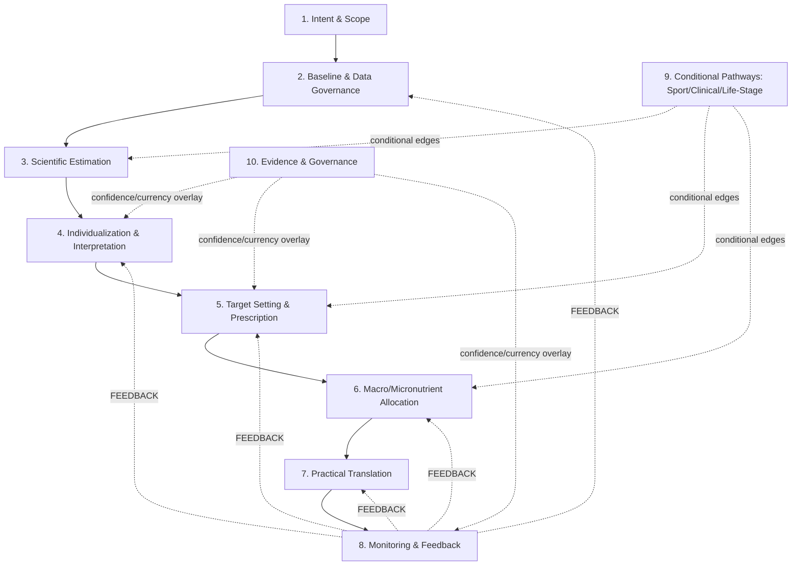
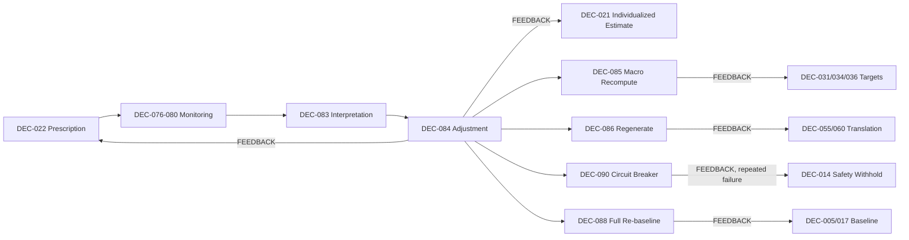

# App Decision Model

Phase 3, Document 5 of 5 (`APP_DECISION_INVENTORY → APP_DECISION_DEPENDENCY_GRAPH →
APP_DECISION_KNOWLEDGE_MAPPING → APP_DECISION_GAPS → APP_DECISION_MODEL`).

---

# 1. Purpose

This document synthesizes the four prior Phase 3 artifacts — 112 decisions, 203 dependency edges (12 of
them `FEEDBACK`), a full two-way knowledge mapping against 213 topics, and a ten-category gap analysis
— into a coherent description of **how the application's decision-making system is structurally
organized**. It answers: *what is the architecture of the decision layer itself* — its layers, gates,
branches, states, bottlenecks, and invariants — not what any individual decision computes.

This document is a **synthesis**, not a new analysis. Every claim here traces back to one of the four
prior documents (§3); nothing here overrides or re-derives them. Where those documents left a question
open, this document restates it as open rather than closing it (§43).

---

# 2. Scope and Non-Goals

**This document is not:** a nutrition textbook, a curriculum, a topic list, an algorithm specification,
a calorie-calculator specification, a database schema, a software architecture, a UI specification, a
recommendation-engine implementation, a clinical protocol, a diagnostic system, a source-book review, or
a current-evidence review.

**This document does not contain:** formulas, numerical thresholds, hard-coded values, pseudocode,
software classes, API endpoints, database tables, UI screens, or exact recommendation algorithms.

**This document describes decision logic and structure** — what kind of determination each layer makes,
what depends on what, where the system must pause for missing information or safety, and where it loops
back on itself — never how a determination is computed.

---

# 3. Source Artifacts and Traceability

| Artifact | What It Established | What This Document Draws From It |
|---|---|---|
| `APP_DECISION_INVENTORY.md` | 112 `DEC` records across 20 domains (A–T), 10 functional layers, the personalization loop, priority classifications | The decision universe itself — every `DEC` ID cited here exists there, unchanged |
| `APP_DECISION_DEPENDENCY_GRAPH.md` | 203 edges (191 forward, 12 `FEEDBACK`), 11 root decisions, high-fan-out/fan-in/bridge/terminal decisions, one bidirectional pair (`DEC-012 ⇄ DEC-099`, distinct from the `FEEDBACK` set) | The structural skeleton — layers, gates, branches, and bottlenecks in this document are read directly off that graph, not re-derived |
| `APP_DECISION_KNOWLEDGE_MAPPING.md` | Full two-way mapping of 112 decisions against 213 knowledge topics, knowledge hubs, islands, personalization/longitudinal/translation knowledge structures | The knowledge-traceability tables in §28 |
| `APP_DECISION_GAPS.md` | A ten-category gap taxonomy (`GAP-A`–`GAP-J`) applied to all 112 decisions and all 213 topics, a P0–P3 prioritized gap matrix | The gap-traceability tables in §29 and the unresolved-question inventory in §43 |

This document does not reproduce the full 112-decision inventory, the full 203-edge register, the full
~300-relationship knowledge mapping, or the full 213-topic gap matrix — those remain authoritative in
their own documents. Tables here are explicitly representative, per the governing brief's own
instruction.

---

# 4. Core Architectural Principles

Ten principles, each already established across the four prior documents, restated here as the
foundation everything else in this document builds on:

1. **Estimation, individualization, target-setting, prescription, translation, monitoring, and
   adjustment are seven distinct decision kinds**, never collapsed into one generic "recommendation"
   step (Decision Model Principles, `APP_DECISION_INVENTORY.md` §2).
2. **Measurement is distinct from interpretation, and interpretation is distinct from adjustment**
   (same source, principle #4/#5) — recording a data point, deciding what it means, and deciding to act
   on it are three separate decision nodes wherever they occur in the model.
3. **A knowledge topic and an application decision are not the same kind of object** — a topic can
   support many decisions, a decision can require many topics, and neither layer mirrors the other
   one-to-one (`APP_DECISION_KNOWLEDGE_MAPPING.md` §2).
4. **The system is a loop, not a pipeline** — 12 `FEEDBACK` edges close real cycles; forcing acyclicity
   would misrepresent the application (`APP_DECISION_DEPENDENCY_GRAPH.md` §7/§17).
5. **Safety and scope can interrupt the general pathway at any point** — `DEC-012`'s scope gate and
   `DEC-014`'s withhold gate exist precisely to make this interruption structural, not incidental.
6. **Conditional pathways (sport, clinical, life-stage) reach *into* the general pipeline rather than
   running beside it** — confirmed structurally in the dependency graph (§9/§14 of that document), not
   merely asserted.
7. **A gap is not automatically a feature, and a knowledge topic is not automatically a decision** —
   both are explicit governing constraints on this document (§44/§45 of the task brief), preserved
   throughout.
8. **Uncertainty is visible, not resolved, at every layer where it appears** — the model represents six
   distinct uncertainty kinds (§21) rather than one generic confidence score.
9. **Personalization is a convergence, never a single topic or a single decision** — every
   VERY-HIGH-personalization decision draws on a mechanistic, an assessment, and a prescriptive
   knowledge source together (`APP_DECISION_KNOWLEDGE_MAPPING.md` §12).
10. **Open human decisions (curriculum spine, clinical scope, evidence currency) remain visible in this
    model, not silently resolved by the act of modeling around them.**

---

# 5. High-Level Decision Flow

The dependency graph's own layer-level diagram (`APP_DECISION_DEPENDENCY_GRAPH.md` §4), restated here
as the model's primary flow — validated against, not merely copied from, the underlying 203-edge graph:

```
USER INTENT (DEC-001–004)
      ↓
BASELINE / PROFILE (DEC-005–011)
      ↓
DATA SUFFICIENCY GATE (DEC-006, 017)
      ↓
SAFETY / SCOPE GATE (DEC-012–016)
      ↓
SCIENTIFIC ESTIMATION (DEC-017–019, 046)
      ↓
OBSERVED RESPONSE (DEC-020, 076–080)              ← accumulates over time
      ↓
INDIVIDUALIZATION (DEC-021, 026)
      ↓
TARGET SETTING (DEC-027, 031, 034, 036, 037)
      ↓
PRESCRIPTION (DEC-022)
      ↓
NUTRIENT / MICRONUTRIENT ALLOCATION (DEC-033, 038–045)
      ↓
PRACTICAL TRANSLATION (DEC-055–075)
      ↓
MONITORING (DEC-076–080)
      ↓
FEEDBACK / INTERPRETATION (DEC-081–083, 091)
      ↓
ADJUSTMENT (DEC-084–090)
      ↺  FEEDBACK edges re-open INDIVIDUALIZATION, PRESCRIPTION, ALLOCATION, TRANSLATION, or BASELINE
```

**This structure is confirmed, not assumed** — every arrow above corresponds to one or more `REQUIRED`
edges in the dependency graph's register, and the closing loop corresponds exactly to the 12 `FEEDBACK`
edges documented there (§22 of this document details them individually). Two refinements the governing
brief's suggested structure did not anticipate, both confirmed by the actual graph: (a) Conditional
Specialized Pathways (sport/clinical/life-stage) are not a pipeline stage at all — they are
`CONDITIONAL` edges reaching into several of the stages above simultaneously (§9); (b) Evidence &
Governance is not a pipeline stage either — it is a cross-cutting layer attaching to almost every other
stage's confidence/currency handling (§27).

---

# 6. Decision Layers

The dependency graph proposed 10 functional layers (its own §3). This document validates that proposal
against the full model rather than accepting it by default.

| # | Layer | Validated? | Note |
|---|---|---|---|
| 1 | Intent & Scope | Yes | `DEC-001` is confirmed the single highest-fan-out node (11 outbound edges) — this layer's centrality is not asserted, it is measured |
| 2 | Baseline & Data Governance | Yes | Root decisions cluster heavily here (5 of 11 root decisions) |
| 3 | Scientific Estimation | Yes | Clean linear `REQUIRED` chain (`DEC-005→...→019`), the most pipeline-like segment of the whole model |
| 4 | Individualization & Interpretation | Yes | Contains the model's single hardest decision (`DEC-110`) and one of its three central bottlenecks (`DEC-021`) |
| 5 | Target Setting & Prescription | Yes | Contains one of the model's two `GAP-E PRIMARY` decisions (`DEC-027`; the other is `DEC-098`'s SPORT-11 relationship, Layer 9) |
| 6 | Macro/Micronutrient Allocation | Yes | Internally ordered (protein → carb → fat, per the register's own dependency chain) |
| 7 | Practical Translation | Yes, but **the model's least knowledge-adequate layer** | Confirmed by the gap analysis as the largest concentration of `GAP-A`/`GAP-D` findings |
| 8 | Monitoring & Feedback | Yes | Where all 12 `FEEDBACK` edges either originate or terminate |
| 9 | Conditional Specialized Pathways | **Refined** — not a "layer" in the same sense as 1–8/10 | Structurally, this is a *set of conditional edges* reaching into layers 3, 5, 6, and 8 (dependency graph §9), not a stage the pipeline passes through in sequence |
| 10 | Evidence & Governance | **Refined** — cross-cutting, not sequential | Attaches to specific decisions across nearly every other layer rather than occupying its own pipeline position |

**Conclusion: the 10-layer proposal survives with two refinements**, not a wholesale restructuring —
Layers 9 and 10 are real and useful groupings, but they are better modeled as *cross-cutting overlays*
on Layers 1–8 than as sequential stages. This refinement is carried through the rest of this document
(§9 models Layer 9 as branches; §27 models Layer 10 as an overlay).

---

# 7. Decision States

**A state is not a decision.** A decision (`DEC-###`) is an act of determination; a state is the
*condition the overall system is in* as a consequence of decisions already made. Conflating the two
would mean treating "the user has been classified as data-sufficient" (a state) as if it were itself
one of the 112 decision nodes, which it is not — it is the *output* of `DEC-006`/`DEC-017` jointly.

Derived from the actual decision layers (not asserted independently of them):

```
UNINITIALIZED
    ↓ (DEC-001–004)
INTENT-ESTABLISHED
    ↓ (DEC-005–011)
PROFILED
    ↓ (DEC-006, 017)
DATA-SUFFICIENT  ⇄  DATA-INSUFFICIENT (returns to PROFILED)
    ↓ (DEC-012–016)
SCOPE-CLEARED  ⇄  ESCALATED (exits the normal pathway — see §23)
    ↓ (DEC-017–019, 046)
ESTIMATED
    ↓ (DEC-020, 076–080 accumulate)
OBSERVED
    ↓ (DEC-021, 026)
INDIVIDUALIZED
    ↓ (DEC-027, 031, 034, 036, 037)
TARGETED
    ↓ (DEC-022)
PRESCRIBED
    ↓ (DEC-033, 038–045, 055–075)
TRANSLATED
    ↓ (DEC-076–080)
MONITORED
    ↓ (DEC-081–083, 091)
ADJUSTMENT-EVALUATED
    ↓ (DEC-084–090)
ADJUSTED  →  loops back to INDIVIDUALIZED, TARGETED, PRESCRIBED, or TRANSLATED (§22)
    or
RE-BASELINE-TRIGGERED  →  loops back to PROFILED (§20)
```

**Two states are not on the main line and can be entered from almost anywhere:** `ESCALATED` (from any
safety-gate decision, §23) and `RE-BASELINE-TRIGGERED` (from `DEC-088`, §20). Neither is a terminal
failure state — both are legitimate, expected states in a system designed around ongoing use rather
than a single completed calculation.

---

# 8. Gates

A gate is a decision whose *output* determines whether the system may proceed, not what it should
compute if it does. Five gate classes are supported by the actual inventory and graph — no additional
gate class was invented.

**Intent Gate** — `DEC-002` (goal clarity) and `DEC-004` (goal/timeframe safety flag). *Permits:*
proceeding to baseline collection with an operational goal. *Blocks:* proceeding on a goal too vague to
drive downstream target-setting. *Unresolved:* the goal-category taxonomy itself is not fixed (per
`DEC-001`'s own note).

**Data Sufficiency Gate** — `DEC-006` (profile sufficiency), `DEC-017` (energy-baseline sufficiency),
`DEC-020` (individualization sufficiency), `DEC-081`/`DEC-082` (adjustment sufficiency/quality, split
per Decision Model Principle #4). *Permits:* proceeding to the next estimation/adjustment stage.
*Blocks:* proceeding on data too sparse or too poor-quality to trust. *Downstream consequence:*
insufficiency does not halt the system — it typically routes to a named-default substitution (`DEC-006`)
or a "continue monitoring" holding state (`DEC-081`/`087`) rather than a dead end.

**Safety Gate** — `DEC-012` (scope boundary), `DEC-013` (red-flag detection), `DEC-014` (withhold-
prescription boundary). *Permits:* continued automated guidance. *Blocks:* generating a prescription at
all, regardless of how complete the data is. *Unresolved:* the exact out-of-scope condition list
(`DEC-012`'s own note) and the withhold-boundary's own thin knowledge grounding (`GAP-F`, largely a
liability/application decision rather than a knowledge one, per the gap analysis).

**Scope Gate** — `DEC-099` (supported-conditions boundary), `DEC-102` (specialized-pathway routing).
*Permits:* clinical modification of the general pipeline. *Blocks:* automated guidance for conditions
outside the supported set. **This is the single most consequential unresolved gate in the model** — the
gap analysis found it `CRITICAL` severity with a 13+-decision cascade, and it is **explicitly not
resolved by this document** (§43).

**Evidence Gate** — no dedicated `DEC` record functions as a gate in the same procedural sense as the
other four; instead, `DEC-108` (evidence-currency flagging) and `DEC-024`/`DEC-112` (confidence
communication) function as an *overlay* that marks a decision's output as evidence-dependent without
blocking it. This is a genuine structural difference from the other four gate classes, not an
oversight — evidence dependency degrades confidence, it does not halt the pipeline the way a safety or
scope gate does.

**Specialized Pathway Gate** — `DEC-093` (recreational vs. structured training), `DEC-098` (female-
athlete track), `DEC-103` (life-stage assignment). *Permits:* entry into a conditional branch (§9).
*Blocks:* nothing outright — these gates route, they do not withhold.

---

# 9. Conditional Branches

Per §6's refinement, branches are `CONDITIONAL` edges reaching into the general pipeline, not parallel
tracks. A branch is recorded here only where downstream decisions **materially differ**, not merely
where a topic domain exists.

**GENERAL** — the default pathway; every decision not explicitly gated by a branch-entry condition
below.

**SPORT** — entry condition: `DEC-093` classifies disclosed activity as structured training. Materially
different downstream decisions: `DEC-019` (activity-adjusted energy), `DEC-031/032/034/035`
(training-adjusted macros), `DEC-047/048` (exercise/environment-adjusted hydration), `DEC-057`
(exercise timing). Sub-branches within SPORT, each independently conditional: competition window
(`DEC-094`), environment (`DEC-096`), female-athlete track (`DEC-098`), RED-S detection (`DEC-095`).

**CLINICAL** — entry condition: a disclosed condition present in `DEC-099`'s (currently undetermined)
supported-conditions set. Materially different downstream decisions: `DEC-021/031/034/036/041` all
receive a `CONDITIONAL` modification via `DEC-100`. **This branch's entry condition is itself
unresolved** — the branch structure is confirmed, but which conditions trigger it is not (§43).

**LIFE-STAGE** — entry condition: `DEC-103` assigns a non-default life stage (pregnancy/lactation,
infancy, childhood, adolescence, or older adulthood — explicitly *not* general adulthood, per `DEC-103`'s
own note that "adult, no special flag" is the expected common case, not a branch entry). Materially
different downstream decisions: `DEC-012` (scope, for pregnancy specifically), `DEC-045` (micronutrient
screening), `DEC-104` (default requirement/monitoring adjustment).

**SPECIAL POPULATION** — not a single branch but a *label this document declines to create as its own
node*, because the gap analysis found no decision cluster where "special population" status alone
(independent of Sport/Clinical/Life-Stage) produces materially different downstream decisions. Where
the governing brief's candidate branch list names "special population" separately, this model finds
that need is already served by the three branches above acting in combination (e.g. a pregnant athlete
enters both LIFE-STAGE and SPORT).

---

# 10. Upstream / Intermediate / Downstream Decisions

Verified against the actual dependency-graph edge counts (`APP_DECISION_DEPENDENCY_GRAPH.md` §11–15),
not assumed from the brief's suggested list.

| Category | Decisions | Verified Role |
|---|---|---|
| **Upstream (root or near-root, high fan-out)** | `DEC-001` (11 outbound edges), `DEC-092` (8–9 outbound), `DEC-076` (8 outbound), `DEC-103`, `DEC-099` | Confirmed — these establish information consumed widely downstream |
| **Intermediate (transform information into targets)** | `DEC-021` (bridges Estimation→Prescription), `DEC-022` (bridges Individualization→Allocation), `DEC-031/034/036` (allocation) | Confirmed — each sits between a knowledge-convergence input set and a further-downstream consumer |
| **Downstream (translate/operationalize)** | `DEC-060–075` (the Practical Translation cluster), `DEC-089` (notification) | Confirmed — these are exactly the decisions the dependency graph's §15 identified as terminal/near-terminal |
| **Feedback (reopen earlier decisions)** | `DEC-084, 085, 086, 088, 090, 097` | Confirmed — these are precisely the 6 `FEEDBACK`-edge source decisions, firing 12 edges between them (§22 details each); `DEC-099` is excluded from this row — its relationship with `DEC-012` is a bidirectional `REQUIRED` dependency, not a `FEEDBACK` loop-closure (see §19) |

**On the brief's suggested attention list — verified, not assumed, per decision:**
- `DEC-001`: confirmed highest-fan-out root (§12 of the dependency graph).
- `DEC-021`: confirmed one of three central bottlenecks, and a bridge (Level-1→Level-2 crossing).
- `DEC-022`: confirmed high fan-in (4 inbound) and the Estimate→Prescription bridge point.
- `DEC-084`: confirmed one of three central bottlenecks and the loop's pivot (3 outbound `FEEDBACK`
  edges).
- `DEC-092`: confirmed a true bridge — the *only* edge connecting Sport's data intake to the general
  pipeline (removing it would disconnect Domain P entirely).
- `DEC-100`: confirmed a true bridge — the *only* path by which a clinical flag reaches into numeric-
  target decisions — **and** confirmed to carry a simultaneous scope gap, a combination no other
  decision in the model has (gap analysis §16).
- `DEC-110`: confirmed the single hardest decision by knowledge convergence (3 domains at `CORE`
  strength), though **not** a high-fan-out or high-fan-in node — its centrality is entirely about
  reasoning difficulty, not graph position, a distinction the brief's list did not itself draw.

---

# 11. Decision Bottlenecks and Hubs

| Decision | Bottleneck Type | Feeds From | Feeds Into | Knowledge Required | Gap Risk | Safety-Critical? | Evidence-Dependent? | In Feedback Loop? |
|---|---|---|---|---|---|---|---|---|
| `DEC-021` | Knowledge convergence | `DEC-019, 020` | `DEC-022, 027, 110` | BODY-01, ASSESS-01, RESEARCH-02 | Low (content adequate; convergence risk only) | No | No | Yes (feedback target of `DEC-084`) |
| `DEC-084` | Loop pivot | `DEC-083` | `DEC-021, 022, 085, 086, 088–090` (3 via `FEEDBACK`) | BODY-01, BODY-05, MET-08 | Low | Indirectly (feeds `DEC-090`'s escalation) | No | Yes — the central pivot |
| `DEC-110` | Reasoning-difficulty convergence | `DEC-021, 082, 083` | `DEC-084` | RESEARCH-02, BODY-01, ASSESS-01 | Low (content adequate) | No | No | Indirectly |
| `DEC-100` | Bridge + scope gap (unique combination) | `DEC-099` | `DEC-021, 031, 034, 036, 041` (5 outbound) | CLIN-07/10/12/24, MET-10 | **High** (`GAP-F`, `CRITICAL`) | Yes | Yes (`IMPORTANT` tier) | No |
| `DEC-099` | Scope gate, highest-cascade | `DEC-012` | `DEC-012` (⇄), `DEC-100, 102, 045` | CLIN-01 + 8 candidate topics | **High** (`GAP-F`, `CRITICAL`) | Yes | Yes | No |
| `DEC-092` | Bridge (sole Sport↔general connector) | (root) | `DEC-019, 031, 034, 035, 047, 057, 093, 095` | SPORT-01/02 | Low | No | No | No |
| `DEC-027` | Evidence bottleneck | `DEC-001, 003, 014, 021` | `DEC-022` | BODY-04/05 | **High** (`GAP-E PRIMARY`, `CRITICAL`) | No (but affects prescription safety indirectly) | **Yes — one of the model's two `PRIMARY`-tier decisions (with `DEC-098`'s SPORT-11 relationship, §25)** | No |

This table is representative, not exhaustive — full bottleneck detail remains in
`APP_DECISION_DEPENDENCY_GRAPH.md` §16–17 and `APP_DECISION_GAPS.md` §6/§16.

---

# 12. Estimation Layer

Estimation determines **"what does the science/model suggest is true,"** nothing more. It is
categorically prior to, and separate from, prescription (§15).

```
Population / Scientific Estimate (DEC-017–018: is baseline data sufficient? which method-class?)
        ↓
Initial Individual Estimate (DEC-019: population/model estimate + this user's disclosed activity)
        ↓
Observed Individual Response (DEC-020, 076–080: accumulated over time, not instantaneous)
        ↓
Individualized Estimate (DEC-021: reconciling the initial estimate against observed reality)
```

**What estimation is trying to determine:** a defensible figure for what this specific body's energy
requirement (and, by parallel construction, its fluid/hydration baseline, `DEC-046`) actually is —
first from population knowledge alone, then refined by that individual's own data.

**What inputs conceptually influence it:** profile data (body size, age, sex), disclosed activity/
training, and — once available — logged intake and weight/composition trend. No specific formula or
equation is named; `DEC-018` explicitly stops at "a method-class exists," never selecting one.

**What uncertainty exists:** measurement uncertainty (is the profile data accurate — `ASSESS-01`),
individual-response uncertainty (does this person's physiology match the population model —
`RESEARCH-02`'s confounding concept), and evidence uncertainty (is the underlying method-class itself
current) — three of the six kinds tracked in §21, all attaching to this layer specifically.

**How observed response informs later estimation:** this is precisely the `DEC-020→021` transition —
observed data does not replace the initial estimate, it is *reconciled against* it, preserving Decision
Model Principle #2 (initial estimate ≠ individualized estimate) structurally rather than by convention.

**How estimation differs from prescription:** an estimate answers "what is," a prescription (§15)
answers "what should be recommended given a goal." `DEC-021`'s output feeds `DEC-022` as one of several
inputs; it is never itself displayed as if it were the recommendation.

---

# 13. Individualization Layer

Individualization is the decision layer that moves the system from **a general estimate** to **an
account of this specific individual's observed response** — distinct from both the estimation that
precedes it and the target-setting that follows it.

**Conceptual inputs considered** (per `DEC-021`'s actual dependency set, not invented): observed intake
history, body-weight/composition trend (`DEC-026`), training context (via `DEC-092`'s upstream feed
into `DEC-019`), the stated goal (via `DEC-022`, downstream — individualization itself is goal-agnostic),
measurement quality (`ASSESS-01`), and the accumulated duration/volume of longitudinal data
(`DEC-020`'s own sufficiency gate).

**How the transition is modeled, conceptually:** `DEC-021` does not compute a new number from a
formula — it *reconciles* two already-computed quantities (the initial estimate and the observed
signal), weighted by how much confidence each currently deserves. No equation or adjustment rule is
specified; the reconciliation itself is the decision being modeled, not its arithmetic.

**Uncertainty in this layer is structurally elevated, not incidental** — `DEC-021` is one of only three
decisions in the entire model with three simultaneous `CORE`-strength knowledge domains converging
(§11), and it is the single node where the dependency graph's central `FEEDBACK` loop closes back onto
itself (`DEC-084 → DEC-021`). This is why the knowledge mapping flagged `DEC-021`/`DEC-110` as the two
decisions requiring the most reasoning depth in the whole model.

---

# 14. Target Setting

Target setting answers **"what outcome is desired, and at what rate/direction should the system move
toward it"** — deliberately kept separate from both "what is currently happening" (individualization,
§13) and "what should the daily intake number be" (prescription, §15).

```
WHAT IS CURRENTLY HAPPENING?           ← DEC-021 (individualized estimate), DEC-026 (trend interpretation)
WHAT OUTCOME IS DESIRED?                ← DEC-001/003 (goal), carried forward, not re-decided here
WHAT RATE/DIRECTION IS APPROPRIATE?     ← DEC-027 — explicitly does not fix a numeric rate
```

**`DEC-027` is preserved here exactly as the gap analysis classified it: the model's only `GAP-E,
PRIMARY` decision.** The 7-book corpus establishes that a rate/direction decision must exist and must
reflect the goal and the individualized estimate — it does not establish what an appropriate current
rate actually is. This document does not resolve that; it is explicitly named as a future evidence-review
task (`06_EVIDENCE_AND_GAPS/`, not yet started).

Target setting for macronutrients (`DEC-031, 034, 036, 037`) follows the same three-question structure,
substituting "what is the current allocation" and "what training/goal context modifies it" for the
energy-specific version above — but none of the macro sub-targets carry `DEC-027`'s `PRIMARY` evidence
flag; they are `LIKELY COVERED` per the gap analysis.

---

# 15. Prescription

Prescription is the single decision (`DEC-022`) that translates a desired outcome (§14) into a concrete
current intake target — the point at which "what is true" and "what is wanted" combine into "what
should currently be recommended."

```
ESTIMATE (DEC-021: what is true)
        +
TARGET (DEC-027: what rate/direction is wanted)
        +
GOAL (DEC-001/003, carried forward)
        +
SAFETY GATE (DEC-014: may this even be issued?)
        ↓
PRESCRIPTION (DEC-022)
```

`DEC-022` has the highest inbound convergence of any single-purpose (non-translation) decision in the
model — four `REQUIRED` inbound edges (`DEC-021, 001, 003, 014`) — confirming its role as the
Estimate→Prescription bridge point that Decision Model Principle #1 exists specifically to keep distinct
from `DEC-021`. **No calorie or macro formula is specified anywhere in this model** — `DEC-022`'s own
knowledge mapping stops at `BODY-01/04/05`'s conceptual energy-balance/weight-management content,
carrying a `GAP-E` (`IMPORTANT` tier, not `PRIMARY`) flag for contemporary prescription standards.

---

# 16. Nutrient Allocation

Allocation is distinct from both the *requirement knowledge* that grounds it and the *food translation*
that follows it — three separate conceptual steps, illustrated once here for protein and generalized to
the rest:

```
REQUIREMENT KNOWLEDGE (PRO-04: what protein intake range is defensible for this profile/training/goal)
        ↓
ALLOCATION DECISION (DEC-031/032/033: how much, adjusted for training, distributed across occasions)
        ↓
FOOD TRANSLATION (DEC-060+: which foods, in what quantity, deliver this allocation) — a separate layer, §17
```

**Carbohydrate** (`DEC-034/035/037`) follows the same three-step structure, with the added wrinkle that
its allocation is computed *net of* protein's already-allocated share of the energy budget (confirmed by
the dependency register's own edge: `DEC-031 → DEC-034`). **Fat** (`DEC-036`) is allocated as the
budget's remainder, net of both protein and carbohydrate. **Fiber** (`DEC-037`) sits inside the
carbohydrate allocation but is flagged `GAP-C` — a real but thin representation (a subsection of
`CHO-04`, not a dedicated topic). **Micronutrients** (`DEC-041–045`) follow a different structure
entirely — adequacy interpretation, risk-flagging, food-source translation, and supplementation
consideration are four separate decisions, not stages of one allocation, because a micronutrient
target is not a single number the way a macro target is. **Fluid/hydration** (`DEC-046–050`) parallels
the energy-estimation structure (§12) more than the macro-allocation structure — a baseline estimate,
adjusted for exercise and environment, translated into replacement guidance.

**A disclosed dietary pattern or restriction** (`DEC-038`, drawing on `NUT-03`) sits above all three
macro allocations at once — it is a single override decision, not a separate per-macro one, since a
pattern like vegan or ketogenic constrains the *food-selection space* the allocations are later
translated into (§17) rather than changing the protein/carb/fat arithmetic itself.

**No gram, milligram, percentage, or ratio value appears anywhere in this section** — every reference
above is to a *decision node's existence and inputs*, never its output value.

---

# 17. Practical Translation

**Mandatory section.** The chain, each stage classified per the gap analysis's own findings (no new
classification performed here):

| Stage | Decision(s) | Knowledge Support | Coverage | Gap/Translation Nature | Layer |
|---|---|---|---|---|---|
| Scientific Target | DEC-022, 031, 034, 036 | BODY, PRO, CHO, LIP (CORE) | COVERED | — | Curriculum |
| Nutrient Target (per-occasion) | DEC-056 | SPORT-03 (CORE) | COVERED | — | Curriculum |
| Meal Structure | DEC-055, 057–059 | SPORT-03/13 (CORE) | COVERED | — | Curriculum |
| Food Selection | DEC-060–064 | NUT-02/04, CLIN-03 (CORE) | COVERED | — | Curriculum |
| Portion / Quantity | DEC-060, 062 | NUT-04 + KM16's Exchange List precedent (thin) | PARTIALLY COVERED | `GAP-C` — application depth, not absence | Curriculum, thin |
| Recipe / Preparation | DEC-066–069 | None | NOT COVERED | `GAP-A`/`GAP-D` — a categorically different (culinary) knowledge domain, confirmed absent from all 7 books | **Application or future product layer** — not curriculum |
| Shopping | DEC-071–075 | PUBHEALTH-04/05 (cost/availability context only) | NOT COVERED | `GAP-D` — the underlying nutrient/food knowledge is complete; only logistics is missing | **Product layer**, not curriculum |

**This document does not resolve the Practical Translation domain question.** Per the gap analysis's
own five-condition test, the Preparation/Recipe portion remains classified `POTENTIAL DOMAIN —
REQUIRES FURTHER VALIDATION`; that status is preserved here unchanged, not upgraded or downgraded.

**Shopping as a product-layer question, explicitly preserved:** shopping-list generation, quantity
consolidation, and pantry reconciliation (`DEC-065, 071, 072, 073–075`) do **not** require a new
nutrition-science curriculum domain. The gap analysis's five-condition test found this candidate fails
condition 4 (it is closer to implementation/product detail than to a curriculum knowledge domain) and
condition 6 (this application's own existing grocery/pantry product surface is already a viable
translation-layer answer). The conceptual boundary, and nothing beyond it, is:

```
NUTRITION KNOWLEDGE                    PRODUCT / LOGISTICS CAPABILITY
(what to eat, how much,          ≠     (consolidating a list, checking it
 which nutrients matter)                against what's already on hand)
```

`DEC-065/071/072` sit entirely on the right side of this boundary. **No product implementation is
designed here** — the boundary itself, and the fact that this application's own pantry-tracking
capability is the natural home for the right-hand side, is the full extent of what this document
establishes.

---

# 18. Monitoring

Monitoring is what makes the loop possible — but monitoring itself is only the *measurement* half of a
three-part structure this section keeps explicitly separate:

```
MEASUREMENT (DEC-076: what is logged, DEC-077: how good is the logged data)
        ≠
INTERPRETATION (DEC-026, 083: what does the measured pattern mean)
        ≠
ADJUSTMENT (DEC-084+: what, if anything, changes as a result)
```

**Monitoring domains supported by the actual decision inventory** (not invented): intake (`DEC-076`),
body weight/composition (`DEC-025, 076`), training/activity (via `DEC-092`'s ongoing feed), symptoms —
GI (`DEC-051`) and safety-relevant (`DEC-013, 016`), adherence (`DEC-078`), and hunger/satiety
(`DEC-058`, self-reported). **No exact measurement schedule, frequency, or cadence is specified anywhere**
— `DEC-076` establishes that a schedule decision exists, never what the schedule is.

**Data-quality assessment is itself a monitoring-layer decision, not an afterthought:** `DEC-077`
(per-input quality rating), `DEC-078` (adherence tracking), `DEC-079` (missing-data handling — explicitly
designed to prevent the system from silently treating absence-of-data as evidence-of-no-change) are all
first-class monitoring decisions in their own right, not implementation details of logging.

---

# 19. Feedback and Adjustment

The 12 `FEEDBACK` edges from the dependency graph, reproduced here exactly (no new feedback relationship
is invented):

```
DEC-084 → DEC-021   (adjustment re-opens the individualized estimate for the next cycle)
DEC-084 → DEC-022   (adjustment re-opens the prescription)
DEC-084 → DEC-039   (adjustment verdict determines whether macro targets move too)
DEC-085 → DEC-031   (macro recompute re-opens protein target)
DEC-085 → DEC-034   (macro recompute re-opens carbohydrate target)
DEC-085 → DEC-036   (macro recompute re-opens fat target)
DEC-086 → DEC-055   (regeneration re-opens meal structure)
DEC-086 → DEC-060   (regeneration re-opens food-selection translation)
DEC-088 → DEC-005   (full re-baseline restarts profile sufficiency)
DEC-088 → DEC-017   (full re-baseline restarts energy-baseline sufficiency)
DEC-090 → DEC-014   (repeated non-response feeds the safety withhold gate)
DEC-097 → DEC-041   (supplement reconciliation revises micronutrient adequacy)
```

(*Post-audit correction:* an earlier version of this section listed 12 rows but incorrectly included
`DEC-099 → DEC-012` in place of `DEC-084 → DEC-039`. The register types `DEC-099 → DEC-012` — and its
reverse, `DEC-012 → DEC-099` — as `REQUIRED`, not `FEEDBACK`; it is a bidirectional mutual dependency,
documented on its own terms immediately below, not a temporal loop-closure. `DEC-084 → DEC-039` is the
edge the register actually types `FEEDBACK` and belongs in this list. This correction changes only this
document's own bookkeeping — no edge, decision, or dependency in the underlying architecture changed.)

```
PRESCRIPTION (DEC-022)
     ↓
OBSERVED RESPONSE (DEC-076–080, accumulating)
     ↓
INTERPRETATION (DEC-083: consistent or not?)
     ↓
ADJUSTMENT (DEC-084: change or hold?)
     ↓
RE-ESTIMATION (DEC-021, via FEEDBACK)  ──┐
     ↓                                    │
RE-TARGETING (DEC-031/034/036, via FEEDBACK) │  all three re-entry
     ↓                                    │  points are real, distinct,
RE-PRESCRIPTION (DEC-022, via FEEDBACK) ──┘  and independently triggerable
```

**`DEC-012 ⇄ DEC-099` is a bidirectional `REQUIRED` dependency, not a `FEEDBACK` edge — flagged here
exactly as the dependency graph flags it.** Determining a user's coarse in/out-of-scope status and
determining the specific supported-conditions list are mutually informing questions, evaluated together
rather than one reopening the other after a full cycle; this model does not attempt to break that
mutual dependency into a one-directional edge, per the dependency graph's own explicit finding (§17
there), and does not conflate it with the loop-closing `FEEDBACK` mechanism described above.

**No feedback relationship beyond these 12 edges is asserted anywhere in this document.**

---

# 20. Re-Baselining

Re-baselining is the model's "start over from Baseline" path, distinct from an ordinary incremental
adjustment (§19). It exists as a named decision (`DEC-088`) precisely so the model does not treat every
observed divergence as either "ignore it" or "tweak the number" — a third option, "the current baseline
itself may no longer be valid," is structurally available.

**Triggers for re-baselining, per the actual model (not invented):**
- A pattern of repeated `DEC-084` adjustment cycles failing to produce the expected response
  (`DEC-090`'s circuit-breaker feeding `DEC-088`).
- A material change in profile data judged implausible or significantly conflicting (`DEC-009/010`
  feeding back into `DEC-006`).
- A life-stage transition detected mid-use (`DEC-105` — pregnancy onset is the paradigm case, which
  also re-triggers the safety-scope check `DEC-012`).
- A goal change (not itself modeled as a separate re-baseline trigger in the inventory, but structurally
  equivalent to re-entering at `DEC-001`).

**What re-baselining does, conceptually:** returns the system to the `PROFILED` state (§7), re-running
`DEC-005/017` sufficiency gates rather than assuming the existing profile/estimate is still valid. **No
algorithm for detecting when to re-baseline is specified** — only that the decision node and its
trigger conditions exist.

---

# 21. Uncertainty

Six distinct uncertainty kinds are tracked throughout this model, never reduced to a single confidence
score:

| Kind | Example Decision(s) | Where It's Visible |
|---|---|---|
| **Measurement uncertainty** | DEC-009, 029, 077 | The input itself may be inaccurate (implausible profile data, irregular weigh-ins, poor dietary recall) |
| **Scientific uncertainty** | DEC-021, 083, 110 | The underlying estimate/interpretation relationship is not precisely known even with perfect data |
| **Evidence uncertainty** | DEC-027 (PRIMARY), 022, 044, 095, 097 | Current evidence may supersede the 7-book corpus's conceptual grounding |
| **Individual-response uncertainty** | DEC-021 (the reconciliation itself exists because of this) | A population estimate does not perfectly predict this specific body |
| **Mapping uncertainty** | DEC-058, 066, 098, 111 (`GAP-G`/`GAP-B` decisions) | The knowledge-to-decision relationship itself needs further validation |
| **Scope uncertainty** | DEC-012, 014, 099, 100 (`GAP-F` decisions) | The application boundary is not yet determined |

**No numerical confidence interval, percentage, or score is assigned anywhere in this model.**
`DEC-024/029/077/112` establish that a confidence-*communication* mechanism must exist and must be
consistent across the model — they do not specify what that communication looks like or what values it
takes.

---

# 22. Data Sufficiency

Data sufficiency is modeled as a **gate/state**, not a UI validation step. `DEC-006, 017, 020, 081, 082`
each ask a version of the same structural question — "is there enough, and good-enough, information to
proceed to the next decision" — at a different point in the pipeline.

**How insufficiency affects downstream decisions, conceptually (not as a rule):**
- At `DEC-006`: insufficiency routes to a *named-default substitution*, not a hard stop — the pipeline
  can proceed with reduced confidence rather than blocking entirely.
- At `DEC-017`: insufficiency blocks estimation outright until more baseline data is provided.
- At `DEC-020`: insufficiency means the system continues operating on the *initial* estimate rather than
  advancing to an individualized one — a graceful degradation, not a failure state.
- At `DEC-081/082`: insufficiency (quantity or quality) routes to `DEC-087`'s explicit "wait vs. adjust"
  decision — the system is designed to prefer waiting over acting on data it cannot yet trust.

**No exact minimum-data rule (a number of days, a number of logged meals, a specific data-completeness
percentage) is defined anywhere in this model** — every sufficiency decision above is a *named gate*,
never a threshold.

---

# 23. Safety and Escalation

Three-way distinction, preserved exactly as `APP_DECISION_GAPS.md` §11 and the dependency graph's
Domain C established it:

```
NORMAL NUTRITION DECISION SUPPORT
        ↓ (a condition or symptom is disclosed/observed)
CONDITIONAL / SPECIALIZED PATHWAY (§9's Sport/Clinical/Life-Stage branches)
        ↓ (the condition falls outside what any branch supports, or a red flag fires)
ESCALATION / OUT-OF-SCOPE (DEC-012, 013, 014, 090)
```

**No medical diagnostic rule and no red-flag numerical threshold is defined anywhere in this model** —
`DEC-013`'s own record explicitly states "no diagnostic criteria are defined here," preserved unchanged.
**Clinical scope uncertainty associated with `DEC-099` is explicitly preserved, not resolved, in this
section** — see §24 for its full treatment as the model's central open governance question.

---

# 24. Clinical Pathway

Modeled structurally, **without resolving `DEC-099`'s unresolved scope** — per the task's explicit
instruction, this section documents the pathway's shape, not its final boundary.

```
GENERAL PIPELINE
       ↓ (a clinical condition is disclosed)
CLINICAL RELEVANCE DETECTED
       ↓
SCOPE CHECK (DEC-012 ⇄ DEC-099 — the model's one bidirectional dependency)
       ↓
        ├── SUPPORTED CLINICAL MODIFICATION (DEC-100 → conditionally modifies DEC-021, 031, 034, 036, 041)
        │        ↓
        │   DEC-101 (goal-conflict resolution) / DEC-102 (pathway routing)
        │
        └── ESCALATION / OUT OF SCOPE (DEC-014 withholds prescription; refers out)
```

**`DEC-099` and `DEC-100` are the two central unresolved structural decisions in this pathway, exactly
as the task brief names them.** This document does not decide which of the 27 CLIN topics
(`CLINICAL_NUTRITION_ARCHITECTURE.md`'s 23 general Layer-5 topics plus 10 Layer-6 SPECIALIZED topics)
belong in the "supported" set, and does not convert the application into a diagnostic system anywhere
in this model — `DEC-013`'s explicit non-diagnostic framing (§23) applies equally here. The knowledge
to support the three most-cited candidate conditions (diabetes `CLIN-07`, cardiovascular `CLIN-10`,
renal `CLIN-12`) is already adequate per the knowledge mapping; **the gap is entirely the scope decision
itself**, not the underlying science (gap analysis §11, §22 finding 1).

---

# 25. Sport Pathway

Modeled against the existing `SPORT_NUTRITION_ARCHITECTURE.md` role table, **not redesigned**.

```
GENERAL PIPELINE
       ↓ (training/activity data disclosed — DEC-092, the sole Sport↔general bridge)
STRUCTURED-TRAINING CLASSIFICATION (DEC-093)
       ↓
        ├── Energy/macro/hydration/timing adjustment (DEC-019, 031/032/034/035, 047/048, 057) — always
        │   applied once structured training is classified, not itself a further branch
        ├── Competition window (DEC-094) — conditional on a disclosed event
        ├── Environment (DEC-096) — conditional on disclosed travel/heat/altitude
        ├── Female-athlete track (DEC-098) — conditional on disclosed sex/cycle data
        ├── RED-S/overtraining detection (DEC-095) — safety-relevant, evidence-dependent
        └── Supplement reconciliation (DEC-097) — evidence-dependent
```

**SPORT-08 (Exercise Immunology) is explicitly preserved as an open question, not silently resolved.**
The gap analysis found this topic exists in the curriculum with no corresponding `DEC` record anywhere
in the inventory — this document does not add one; it restates the observation (§31, §39, §43).
**SPORT-11 (Personalized/Precision Sport Nutrition) is explicitly preserved as an evidence frontier,**
carrying the model's only other `PRIMARY`-tier current-evidence flag alongside `DEC-027` — its
relationship to `DEC-098` remains `MAPPING UNCERTAIN`, not upgraded to confirmed here.

---

# 26. Life-Stage / Special Population Pathways

**Not every life-stage topic becomes a separate branch** — per §9's finding, "general adulthood" is the
expected default outcome of `DEC-103`, not a branch-entry condition. The distinction preserved
throughout this model:

```
GENERAL NUTRITION LOGIC                LIFE-STAGE MODIFIER
(applies by default)              ≠    (DEC-104: activates only when DEC-103 assigns a
                                         non-default stage — pregnancy/lactation, infancy,
                                         childhood, adolescence, or older adulthood)
```

**LIFE-05 (Adulthood)'s status is explicitly left unresolved here, exactly as Phase 2 left it** —
`CANDIDATE_EXCLUSIONS.md` already flagged it as the weakest life-stage topic for dedicated treatment,
and this document does not upgrade or downgrade that finding. A mid-use life-stage **transition**
(`DEC-105`) is modeled as a trigger that can re-enter the pipeline at the safety-scope gate (§23) and
the requirement-defaults decision (`DEC-104`) simultaneously — pregnancy onset is the paradigm case for
both.

**"Special population" is not modeled as its own fourth branch** (§9) — the gap analysis and dependency
graph found no decision cluster where that label alone, independent of Sport/Clinical/Life-Stage,
produces materially different downstream decisions. Combinations (e.g. a pregnant athlete) are modeled
as multiple branches active simultaneously, not a distinct combined branch type.

---

# 27. Evidence and Governance

A cross-cutting overlay (§6's refinement), not a pipeline stage. Four layers kept explicitly distinct:

```
SCIENTIFIC KNOWLEDGE          — the 213-topic universe itself, curriculum-layer, largely stable
        ≠
CURRENT EVIDENCE REQUIREMENT  — DEC-108's flagging mechanism; attaches to specific decisions
                                 (DEC-027 PRIMARY; DEC-003/004/012/013/016/022/030/044/095/097/099/100/107
                                 IMPORTANT; DEC-107 SUPPORTING) without halting them
        ≠
APPLICATION SCOPE              — DEC-099/DEC-102's boundary question; gates whether a decision fires
                                  at all, distinct from how confident its content is
        ≠
SAFETY / ESCALATION            — DEC-012/013/014; can override both of the above at any point
```

**`DEC-027` is preserved here, one final time, as the model's central evidence-dependent bottleneck** —
the only decision carrying a `PRIMARY` (not merely `IMPORTANT`) current-evidence tier, and the clearest
single illustration of why "scientific knowledge" and "current evidence requirement" must be tracked as
different properties of the same decision rather than one confidence number. **No evidence engine, no
evidence-grading system, and no evidence review is performed or designed anywhere in this document.**

---

# 28. Knowledge-to-Decision Traceability

Representative, not exhaustive — the complete ~300-relationship mapping remains authoritative in
`APP_DECISION_KNOWLEDGE_MAPPING.md`.

| Layer | Representative DEC IDs | Representative Knowledge Topics | Representative Dependency | Representative Gap |
|---|---|---|---|---|
| Intent & Scope | DEC-001, 012 | BODY-01, CLIN-01, LIFE-01 | DEC-001→004 (REQUIRED) | — |
| Scientific Estimation | DEC-017–019 | BODY-02, SPORT-01/02 | DEC-018→019 (REQUIRED) | — |
| Individualization | DEC-020, 021 | BODY-01, ASSESS-01, RESEARCH-02 | DEC-019,020→021 (REQUIRED) | GAP-I (secondary) |
| Target/Prescription | DEC-022, 027 | BODY-04/05 | DEC-021→022 (REQUIRED) | GAP-E, PRIMARY on 027 |
| Allocation | DEC-031, 034, 036 | PRO-04, CHO-04, LIP-05 | DEC-031→034→036 (REQUIRED chain) | GAP-C on fiber (037) |
| Practical Translation | DEC-060, 066, 071 | NUT-02/04; none for 066/071 | DEC-060→066→071 (REQUIRED chain) | GAP-C/A/D respectively |
| Monitoring/Feedback | DEC-076, 084 | ASSESS-01, BODY-01 | DEC-084→021 (FEEDBACK) | — |
| Sport | DEC-092, 095 | SPORT-01/02, SPORT-10 | DEC-092→019 (REQUIRED, bridge) | GAP-E on 095 |
| Clinical | DEC-099, 100 | CLIN-01, CLIN-07/10/12 | DEC-099→100 (REQUIRED) | GAP-F, CRITICAL |
| Evidence/Governance | DEC-108, 111 | RESEARCH-01, RESEARCH-15 | — | GAP-G on 111 |

---

# 29. Gap-to-Model Traceability

Every gap category from `APP_DECISION_GAPS.md` §2, shown against where it lands in this model — gaps
are shown, not solved, per the task's explicit instruction.

| Gap Category | Model Location | Nature |
|---|---|---|
| `GAP-A` (no representation) | §17 — Recipe/Preparation decisions (`DEC-067–069`) | A categorically different (culinary) knowledge domain |
| `GAP-B` (content inspection) | §25's SPORT-11 note; GI-03 (feeds `DEC-051/054`, §18) | Not yet a confirmed gap of any kind |
| `GAP-C` (application depth) | §16's fiber sub-target (`DEC-037`); §22's macro-adjustment logic (`DEC-039/085`) | Topic exists, thin |
| `GAP-D` (translation) | §17/§18 — Meal construction, Shopping (`DEC-065, 066, 070–075, 086`) | Science adequate, action bridge missing |
| `GAP-E` (current evidence) | §14 (`DEC-027`, PRIMARY); §25 (Sport currency); §24 (Clinical currency) | Corpus insufficient alone |
| `GAP-F` (scope/governance) | §24 (`DEC-099/100`, CRITICAL); §26 (life-stage combination) | Not a knowledge deficiency |
| `GAP-G` (mapping uncertainty) | §21 (`DEC-058, 066, 098, 111`) | Trigger for review, not expansion |
| `GAP-H` (data/measurement) | §27's ASSESS-02/06 future-lab-data note | Data gap, not knowledge gap |
| `GAP-I` (evidence/methods) | §11/§13 — the three knowledge-convergence bottlenecks (`DEC-021, 084, 110`) | Structural risk concentration, not a deficiency |
| `GAP-J` (intentional non-gap) | Not modeled as a decision-layer concern at all — deliberately absent from the pipeline (§35's Table 1 "Major Gaps" column shows `NONE` for layers this affects) | By design |

**No gap above is resolved by this document.** Each is shown occupying a specific place in the
architecture so that a future phase knows *where* to act, not *how*.

---

# 30. Progressive Personalization

The model's central architectural concept, made explicit as its own progression — validated against,
not merely asserted alongside, the personalization-loop structure already established:

```
GENERAL KNOWLEDGE            (the 213-topic curriculum universe — largely CORE/IMPORTANT per the
                               knowledge mapping's centrality bands)
        ↓
GENERAL ESTIMATE              (DEC-017–019 — population/model-based, before any individual data)
        ↓
USER-SPECIFIC BASELINE        (DEC-005–011 — this person's disclosed profile)
        ↓
INDIVIDUAL RESPONSE           (DEC-020, 076–080 — accumulated over time, not instantaneous)
        ↓
INDIVIDUALIZED ESTIMATE       (DEC-021 — reconciling estimate against observed response)
        ↓
PERSONALIZED TARGET           (DEC-027, 031, 034, 036 — goal- and training-adjusted)
        ↓
PERSONALIZED PRESCRIPTION     (DEC-022 — the goal-driven "what now")
        ↓
PERSONALIZED TRANSLATION      (DEC-055–075 — pattern/restriction/pantry-aware)
        ↓
FEEDBACK                      (DEC-081–091 — interpretation and adjustment)
        ↓
FURTHER PERSONALIZATION       (the 12 FEEDBACK edges of §19, re-entering at Individualized Estimate,
                                Personalized Target, Personalized Prescription, or User-Specific Baseline)
```

**This progression is not a new structure invented for this section — it is the same pipeline (§5),
the same layers (§6), and the same feedback edges (§19), read through the single lens of "how does
generality become specificity."** Its value as a standalone framing is that it makes explicit what
`APP_DECISION_KNOWLEDGE_MAPPING.md` §12 already found empirically: every VERY-HIGH-personalization
decision in the model sits at or after the "Individualized Estimate" step, never before it — genericity
and personalization are not blended gradually, they are separated by a specific, identifiable step.

---

# 31. Decision Model Granularity Questions

Per the task's explicit instruction: evaluated, not resolved. Recorded as **MODEL GRANULARITY
QUESTION** where the inventory's current grain is genuinely debatable — the inventory itself remains
authoritative unless a future revision is explicitly approved.

**MODEL GRANULARITY QUESTION — `DEC-039` and `DEC-085`.** Both are flagged `NEEDS CONTENT REVIEW` in
the inventory and `GAP-C` here, both describe "should macro targets change given observed data," and
both currently lack any dedicated knowledge topic. Whether these should remain two decisions (one in
Domain F, one in Domain O) or merge into a single adjustment-logic node is genuinely unclear from the
current evidence — carried forward as open, not decided.

**MODEL GRANULARITY QUESTION — `DEC-092` and `DEC-100` as bridge decisions.** Both are confirmed true
bridges (§10) — the sole connectors between Sport/Clinical and the general pipeline respectively. Given
how much fan-out each carries (`DEC-092`: 8–9 edges; `DEC-100`: 5 edges plus a scope gate), whether their
roles should eventually decompose into several smaller, domain-specific bridge decisions as Sport/
Clinical content grows is an open architectural question, not resolved here.

**MODEL GRANULARITY QUESTION — is `SPORT-08` genuinely absent from the inventory, or is this a decision-
inventory completeness gap?** The topic exists in the curriculum; no `DEC` record addresses illness/
immune-function-aware nutrition guidance anywhere in the 112-decision set. This document does not add
one — it flags the absence as a question for whoever next revises `APP_DECISION_INVENTORY.md`.

**Not flagged as granularity questions** (considered and found adequately grained): the three-way
Estimate/Individualize/Prescribe split (§4 principle #1, structurally load-bearing, not a candidate for
merging); the Domain L/M practical-translation cluster's ten separate decisions (each serves a
genuinely distinct sub-function — meal construction, prep detail, batching, deviation, list-generation,
pantry, budget, availability, frequency — despite sharing one underlying gap).

---

# 32. Model Invariants

Table 5, per the required output structure. Only invariants actually supported by the project are
included — none are aspirational additions.

| Invariant | Why It Matters | Affected Decisions | Risk If Violated |
|---|---|---|---|
| Estimate must remain distinct from prescription | Prevents a population figure from being displayed as if it were a personalized recommendation | DEC-019, 021, 022 | A user receives generic guidance believing it is individualized |
| Measurement must remain distinct from interpretation | Prevents a raw data point from being treated as a conclusion | DEC-076/077 vs. DEC-026/083 | Noise mistaken for a real trend, triggering an unwarranted adjustment |
| Interpretation must remain distinct from adjustment | Prevents every observed divergence from automatically changing the plan | DEC-083 vs. DEC-084 | Overreaction to normal variability; loss of user trust in the plan's stability |
| Safety/scope must be able to interrupt the normal pathway | Ensures escalation is always reachable, from any point | DEC-012, 013, 014 | A condition requiring professional referral is missed because the pipeline "already started" |
| Conditional pathways must not silently overwrite the general model | Ensures Sport/Clinical/Life-Stage modify, rather than replace, the shared core | DEC-092, 100, 104 | Clinical or sport-specific logic could produce contradictory guidance without a clear audit trail |
| Individualization must use observed response where appropriate | Prevents the system from remaining a static calculator | DEC-020, 021 | The application never actually personalizes beyond intake-time profile data |
| Uncertainty must remain visible | Prevents false confidence in evidence-dependent or thinly-mapped decisions | DEC-024, 027, 112 | Users act on a `GAP-E PRIMARY` recommendation believing it is as solid as a `COVERED` one |
| Feedback must be able to reopen earlier decisions | Makes the loop real rather than nominal | The 12 `FEEDBACK` edges (§19) | The system degrades into a one-shot calculator despite being designed as adaptive |
| Practical translation must remain downstream of scientific targets | Preserves Decision Model Principles #6/#7 | DEC-060, 066 | Food/meal suggestions could be generated without ever having been derived from a validated target |
| Knowledge and decision layers must remain traceable but non-identical | Prevents the curriculum from being forced to mirror the decision graph, or vice versa | All 112 decisions, all 213 topics | Curriculum design decisions get silently made by application convenience, or vice versa |
| Current evidence requirements must remain distinguishable from foundational knowledge | Prevents a stable concept (e.g. energy balance) from being treated with the same caution as an unstable one (e.g. target rate) | DEC-022 vs. DEC-027 | Either excessive hedging on solid content, or false confidence on evidence-dependent content |
| Clinical scope must remain explicit | Prevents the application from silently expanding or contracting what it treats as safe to address | DEC-099, 100 | Scope creep into genuine medical advice, or under-delivery on conditions the corpus could safely support |
| The system must not imply diagnosis merely because clinical knowledge exists | Preserves the non-diagnostic framing already established throughout Phase 3 | DEC-013, 053, 090, 099 | The application could be perceived or used as a diagnostic tool, a materially different (and riskier) product |

---

# 33. Architectural Failure Modes

Conceptual failure modes, each paired with the architectural safeguard already present in the model
(not a new fix designed here):

| Failure Mode | Safeguard Already Present |
|---|---|
| Treating an estimate as a prescription | Decision Model Principle #1 (§4); `DEC-021`/`DEC-022` kept as separate nodes with a `REQUIRED` edge between them, never merged |
| Ignoring measurement error | `ASSESS-01`'s data-quality gates (`DEC-077, 082`) sit structurally before interpretation (`DEC-083`) can proceed |
| Prescribing before sufficient baseline information | `DEC-017`'s sufficiency gate blocks `DEC-018` outright rather than degrading silently |
| Ignoring observed individual response | `DEC-020/021`'s individualization step exists specifically so a population estimate is never the final word |
| Treating short-term weight fluctuation as true tissue change | `DEC-026` is modeled as a dedicated interpretation decision, structurally separated from `DEC-084`'s adjustment decision |
| Allowing specialized clinical knowledge to silently alter general decisions | `DEC-100` is explicit and named — clinical modification is a visible, traceable decision node, not an implicit override |
| Using outdated evidence without recognizing it | `DEC-108`'s evidence-currency flagging mechanism exists precisely to make this visible rather than silent |
| Confusing nutrient targets with meal plans | Decision Model Principle #7; `DEC-022` (target) and `DEC-066` (meal) are non-adjacent nodes separated by the entire Allocation and Food-Selection layers |
| Assuming scientific curriculum automatically provides recipe/shopping knowledge | §17's explicit `GAP-A`/`GAP-D` classification for exactly this assumption, confirmed independently by `APPARENT_CURRICULUM_GAPS.md` |
| Creating false precision | Every estimation/target/prescription decision in this model stops at "a method-class/decision exists," never naming a formula — enforced throughout §12–16 |
| Allowing a gap to become an implicit algorithmic assumption | §29's gap-to-model traceability exists specifically so a future implementation cannot silently fill a `GAP-F`/`GAP-E` decision with an invented default without that choice being visible as exactly that |

**No fix is proposed as an algorithm for any failure mode above** — each entry names the structural
property of the *existing* model (established across the four prior documents) that already guards
against it, per the task's explicit instruction.

---

# 34. High-Level System Representation

Three representations, each kept small and readable per the task's explicit instruction not to
reproduce the full 203-edge graph.

**A. High-Level System Flow**

```
INTENT → BASELINE → [DATA GATE] → [SAFETY/SCOPE GATE] → ESTIMATION → OBSERVATION
   → INDIVIDUALIZATION → TARGET → PRESCRIPTION → ALLOCATION → TRANSLATION
   → MONITORING → INTERPRETATION → ADJUSTMENT ─┐
                                                 │
        ┌────────────────────────────────────────┘
        ↓
   re-enters INDIVIDUALIZATION, TARGET, PRESCRIPTION, ALLOCATION, TRANSLATION, or BASELINE
   (per the 12 FEEDBACK edges, §19)

Conditional overlays reaching in at multiple points: SPORT, CLINICAL, LIFE-STAGE (§9, §24–26)
Cross-cutting overlay attaching to most points: EVIDENCE/GOVERNANCE (§27)
```

**B. Layered Decision Architecture**



**C. Feedback Architecture**



---

# 35. Decision Layer Summary

**Table 1**, per the required output structure.

| Layer | Purpose | Representative DEC IDs | Primary Knowledge Domains | Conditional? | Feedback? | Major Gaps |
|---|---|---|---|---|---|---|
| Intent & Scope | Establish goal and whether the app may proceed | 001–004, 012–016 | BODY, CLIN, LIFE | No (scope check touches conditional pathways) | No | GAP-F (via DEC-012⇄099) |
| Baseline & Data Governance | Establish what's known and how reliable | 005–011, 076–077, 109 | ASSESS | No | Yes (re-baseline target) | None material |
| Scientific Estimation | Population/model-based initial figures | 017–019, 046 | BODY, SPORT | Conditional inputs from Sport | No | None material |
| Individualization & Interpretation | Reconcile estimate against observation | 020, 021, 026, 083, 110 | BODY, ASSESS, RESEARCH | No | Yes (feedback target) | GAP-I (secondary, convergence risk) |
| Target Setting & Prescription | Decide what's currently recommended | 022, 027, 031, 034, 036 | BODY | No | Yes (feedback target) | GAP-E, PRIMARY (DEC-027) |
| Macro/Micronutrient Allocation | Distribute/adjust targets | 033, 037–045 | PRO, CHO, LIP, VIT, MIN | No | Yes (feedback target) | GAP-C (fiber, adjustment logic) |
| Practical Translation | Foods, meals, prep, shopping | 055–075, 086 | NUT, SPORT, GI | No | Yes (feedback target) | GAP-A/GAP-D (largest concentration) |
| Monitoring & Feedback | Log, validate, interpret, adjust | 076–091 | ASSESS, RESEARCH, SPECIAL | No | Yes (loop origin) | None material |
| Conditional Specialized Pathways | Sport/Clinical/Life-Stage routing | 092–107 | SPORT, CLIN, LIFE, PUBHEALTH | Yes — by definition | No (feeds into loop via 095, 100) | GAP-F (Clinical, CRITICAL); GAP-E (Sport) |
| Evidence & Governance | Currency flags, conflict detection, confidence | 108–112 | RESEARCH | No (cross-cutting) | No | GAP-G (DEC-111) |

---

# 36. Gate Summary

**Table 2**, per the required output structure.

| Gate | Purpose | Triggering Decisions | Blocks / Permits | Unresolved Issues |
|---|---|---|---|---|
| Intent Gate | Confirm the goal is clear enough to drive downstream decisions | DEC-002, 004 | Blocks target-setting on an unresolved/unsafe goal; permits baseline collection otherwise | Goal-category taxonomy itself not fixed |
| Data Sufficiency Gate | Confirm enough, and good-enough, information exists | DEC-006, 017, 020, 081, 082 | Blocks estimation/individualization/adjustment on insufficient data; permits with named defaults where feasible | No exact minimum-data rule defined (by design) |
| Safety Gate | Detect conditions requiring caution or escalation | DEC-012, 013, 014 | Blocks prescription generation outright | Exact out-of-scope condition list undetermined; withhold-boundary thinly grounded in knowledge |
| Scope Gate | Confirm the request is within supported clinical boundaries | DEC-099, 102 | Blocks/permits clinical modification of the general pipeline | **Central unresolved gate** — DEC-099 explicitly not decided anywhere in Phase 3 |
| Evidence Overlay | Flag (not block) evidence-dependent output | DEC-108, 024, 112 | Degrades displayed confidence; does not halt the pipeline | How degraded confidence is actually communicated is a future design question |
| Specialized Pathway Gate | Route into Sport/Life-Stage branches | DEC-093, 098, 103 | Routes; does not withhold | How simultaneous multi-branch routing combines (e.g. pregnant athlete) is open |

---

# 37. Branch Summary

**Table 3**, per the required output structure.

| Branch | Entry Condition | Major Decisions | Knowledge Domains | Scope Status |
|---|---|---|---|---|
| GENERAL | Default — no special condition disclosed | All decisions not otherwise gated | BODY, ASSESS, NUT, PRO, CHO, LIP, VIT, MIN, FLU | Fully defined |
| SPORT | DEC-093 classifies structured training | 019, 031/032/034/035, 047/048, 055–057, 094–098 | SPORT (all 13 topics, 11 used) | Mostly defined; SPORT-08 absent from inventory, SPORT-11 an evidence frontier |
| CLINICAL | A disclosed condition is in DEC-099's (undetermined) supported set | 021, 031, 034, 036, 041 (via DEC-100); 101, 102 | CLIN (9 of 27 topics concretely mapped; 18 pending) | **Undefined — the model's central open scope question** |
| LIFE-STAGE | DEC-103 assigns a non-default stage | 012 (pregnancy only), 045, 104, 105 | LIFE (5 of 8 topics core/supporting) | Mostly defined; LIFE-05 intentionally thin |

---

# 38. Bottleneck Summary

**Table 4**, per the required output structure (representative — full detail in §11 and the source
documents).

| Decision | Role | Upstream Convergence | Downstream Impact | Knowledge Dependencies | Gap Risk |
|---|---|---|---|---|---|
| DEC-021 | Individualization pivot | DEC-019, 020 | DEC-022, 027, 110 | BODY-01, ASSESS-01, RESEARCH-02 (3-domain convergence) | Low — content adequate |
| DEC-022 | Estimate→Prescription bridge | DEC-021, 001, 003, 014 (4 inbound) | DEC-027, 031, 034, 036 | BODY-01/04/05 | Moderate — GAP-E, IMPORTANT |
| DEC-084 | Adjustment pivot | DEC-083 | DEC-021, 022, 085, 086, 088–090 (3 via FEEDBACK) | BODY-01/05, MET-08 | Low — content adequate |
| DEC-100 | Clinical bridge + scope gate | DEC-099 | DEC-021, 031, 034, 036, 041 (5 outbound) | CLIN-07/10/12/24, MET-10 | **High — GAP-F, CRITICAL** |
| DEC-027 | Evidence bottleneck | DEC-001, 003, 014, 021 | DEC-022 | BODY-04/05 | **High — GAP-E, PRIMARY** |
| DEC-092 | Sport bridge | (root) | 8–9 decisions across D/F/H/J | SPORT-01/02 | Low — content adequate |

---

# 39. Open Model Questions

**Table 6**, per the required output structure. Consolidates every unresolved item this document has
restated (never resolved) throughout — no new question is introduced here beyond what §31 and the four
prior documents already surfaced.

| Question | Affected Decisions | Affected Knowledge | Current Status | Why It Matters |
|---|---|---|---|---|
| Which conditions belong in DEC-099's supported-conditions list? | 012, 014, 015, 045, 099, 100, 101, 102 | CLIN-01 + 27 CLIN topics | Open (`GAP-F`, `CRITICAL`) | Gates the entire clinical pathway; highest-cascade unresolved question in the model |
| Is SPORT-08 a genuine decision-inventory gap? | None currently | SPORT-08 | Open (§31, §39) | Illness/immune-nutrition guidance may be a legitimate missing decision, not just unused knowledge |
| What is an appropriate target rate/direction of change? | 027 (cascades to 022) | BODY-04/05 | Open (`GAP-E`, `PRIMARY`) | The model's only current-evidence-primary decision; affects every weight-change prescription |
| Does the Practical Translation domain warrant new curriculum content? | 065–075, 086 | None (confirmed absent) | Open — `POTENTIAL DOMAIN — REQUIRES FURTHER VALIDATION` | Determines whether this gap is resolved via curriculum, product, or a hybrid |
| Should DEC-039/085 merge into one decision node? | 039, 085 | PRO-04, CHO-04, LIP-05 | Open (MODEL GRANULARITY QUESTION, §31) | Affects the inventory's own grain, not just this model |
| Should DEC-092/100's bridge roles eventually decompose? | 092, 100 | SPORT-*, CLIN-* | Open (MODEL GRANULARITY QUESTION, §31) | Affects future architectural complexity as these domains grow |
| Is LIFE-05 (Adulthood) adequately thin, or does it need dedicated treatment? | 103, 104 | LIFE-05 | Open, carried from Phase 2 | Affects whether "general adult" needs its own life-stage content |
| Should LIP-04/MET-07/RESEARCH-10 get promoted knowledge-mapping links? | 100, 058, 083/091 | LIP-04, MET-07, RESEARCH-10 | Open, carried from `APP_DECISION_KNOWLEDGE_MAPPING.md` §19 | Minor mapping-completeness questions, not currently load-bearing |
| Is ASSESS-02/06's "future lab-data feature" framing realistic? | 041, 042 | ASSESS-02, ASSESS-06 | Open, carried from the gap analysis | A product-scope question, not a knowledge-mapping question |
| Should ASSESS-01.03 be treated as its own de facto topic? | 20+ decisions | ASSESS-01.03 | Open, carried from `APP_DECISION_KNOWLEDGE_MAPPING.md` §19 | It is already the single most-cited knowledge unit in the model despite sitting one level below Level-1 |
| Is the overall curriculum spine choice (Phase 2, Options A–D) relevant to this model? | Indirectly all sport/clinical-sourced decisions | Whichever topics a chosen spine emphasizes | Open, carried from Phase 2 unchanged | Does not block this model, but will matter once curriculum content is actually authored |

---

# 40. Structural Conclusions

1. **The application is architecturally a loop with one dominant forward pipeline and 12 feedback
   edges, not a linear calculator.** This is the single most consequential structural fact this Phase 3
   sequence established, and every other conclusion below depends on treating it as true throughout any
   future implementation.

2. **Three decisions — `DEC-001`, `DEC-021`, `DEC-084` — are the model's architectural center of
   gravity**, independently confirmed across three different analytical lenses (dependency-graph edge
   counts, knowledge-mapping citation counts, gap-analysis severity weighting). Any future
   implementation phase should prioritize getting these three right before optimizing any peripheral
   decision.

3. **The model has exactly one `CRITICAL`-severity knowledge-adequate-but-scope-blocked decision pair
   (`DEC-099/100`) and exactly one `CRITICAL`-severity knowledge-inadequate decision (`DEC-027`).**
   These require different kinds of future work — a human scope decision for the former, an evidence
   review for the latter — and conflating them would misdirect effort.

4. **Practical Translation is simultaneously the model's largest gap concentration and its lowest-
   severity one**, because this specific application's own product surface (grocery/pantry data) is a
   plausible answer to a gap that pure curriculum content cannot close. This is a genuine architectural
   finding, not a hedge: the model's Shopping and (partially) Meal-Construction layers are correctly
   understood as *product* layers wearing a *knowledge-gap* label.

5. **Personalization, uncertainty, and evidence-dependency are each modeled as first-class, multi-
   valued properties of specific decisions — never collapsed into one score.** This is the architectural
   choice most responsible for the model remaining honest about what it does and does not know, and it
   should be preserved through any future implementation, not simplified away for convenience.

6. **This model is deliberately incomplete in the same places the curriculum is deliberately
   incomplete** — the 18 pending-scope CLIN topics, SPORT-11's evidence-frontier status, and the
   Practical Translation domain question all remain open here because closing them was never this
   phase's task. That incompleteness is itself a structural finding worth preserving, not a defect to
   apologize for.

---

# 41. Validation

Checked against the governing brief's 33-item validation checklist (§47):

1–6. The model is derived from the 112-decision inventory (every `DEC` ID cited throughout traces to
`APP_DECISION_INVENTORY.md`, none invented); all major decision layers traceable to actual `DEC` IDs
(§6, §35); the model respects the 203 dependency edges (§5's flow, §10's upstream/downstream roles, and
§38's bottlenecks all cite edges verified in `APP_DECISION_DEPENDENCY_GRAPH.md`, none invented); all
12 feedback edges are represented in full, reproduced verbatim in §19 and §34-C (with `DEC-012 ⇄
DEC-099` correctly documented as a separate bidirectional `REQUIRED` dependency, not a thirteenth
feedback edge); no invented
dependency replaces the authoritative graph (every arrow in §5/§34 corresponds to a register entry);
estimate ≠ individualization ≠ target ≠ prescription preserved throughout (§12–15, each with its own
section and explicit differentiation from its neighbors). ✓

7–12. Measurement ≠ interpretation ≠ adjustment preserved (§18–19, explicit three-way split); gates
distinguished from ordinary decisions (§8, §36 — a gate's defining property, permit/block, is stated for
each); conditional branches distinguished from universal decisions (§9, §37 — entry conditions stated
explicitly); clinical scope remains unresolved (§24, §37, §39 all restate `DEC-099` as open); sport
scope remains unresolved where appropriate (§25, §39 — SPORT-08/SPORT-11 both explicitly open); Practical
Translation remains appropriately unresolved (§17 preserves `POTENTIAL DOMAIN — REQUIRES FURTHER
VALIDATION` unchanged). ✓

13–20. Current evidence distinguished from foundational knowledge (§27's four-way split, `DEC-022` vs.
`DEC-027` contrast); uncertainty explicitly represented (§21, six kinds, no numerical intervals);
data sufficiency explicitly represented (§22, gate/state framing, no thresholds); safety/escalation
explicitly represented (§23, three-way distinction, no diagnostic rules); monitoring and feedback
represented (§18–19); re-baselining represented conceptually (§20, triggers named, no detection
algorithm); knowledge and decision layers not collapsed (§28, explicit many-to-many framing preserved
from Core Principle #3); gaps traced but not prematurely solved (§29, every `GAP-A`–`GAP-J` category
shown occupying a model location, none resolved). ✓

21–28. No formulas invented (checked specifically across §12–17's estimation/target/allocation
sections — every reference stops at "a decision/method-class exists"); no numerical thresholds invented
(checked across §22–23's sufficiency/safety sections); no algorithms designed; no UI designed; no
software architecture designed; no clinical diagnostic system designed (§23–24 explicit non-diagnostic
framing preserved); no web research performed; no source books modified. ✓

29–33. No Phase 1/2 documents modified; no completed Phase 3 documents modified (`APP_DECISION_
INVENTORY.md`, `APP_DECISION_DEPENDENCY_GRAPH.md`, `APP_DECISION_KNOWLEDGE_MAPPING.md`, `APP_DECISION_
GAPS.md` all read-only this session, re-verified present and unmodified before starting — see the
orientation step); no new `DEC` IDs invented (every ID cited already exists in the inventory); no
existing `DEC` IDs deleted; no existing topic IDs modified; open human decisions remain explicitly
visible (§39's consolidated table, plus §24/§25/§26/§31 individually); output file exists at exactly
`05_PHASE_3_APP_DECISION_MODEL/APP_DECISION_MODEL.md`. ✓

---

**Decision Model Status: COMPLETE**

All 41 required sections present; three system representations provided (high-level flow, layered
architecture, feedback architecture) without reproducing the full 203-edge graph; six required tables
completed (Decision Layer Summary, Gate Summary, Branch Summary, Bottleneck Summary, Model Invariants,
Open Model Questions); every open human decision from Phase 1, Phase 2, and the four prior Phase 3
documents restated as open, none silently resolved; no formula, threshold, algorithm, UI, software
architecture, or diagnostic system introduced anywhere. This is the final Phase 3 artifact — no
subsequent phase (curriculum redesign, evidence review, algorithm design, implementation) is started in
this session, per the governing brief's explicit instruction to stop after this document.
